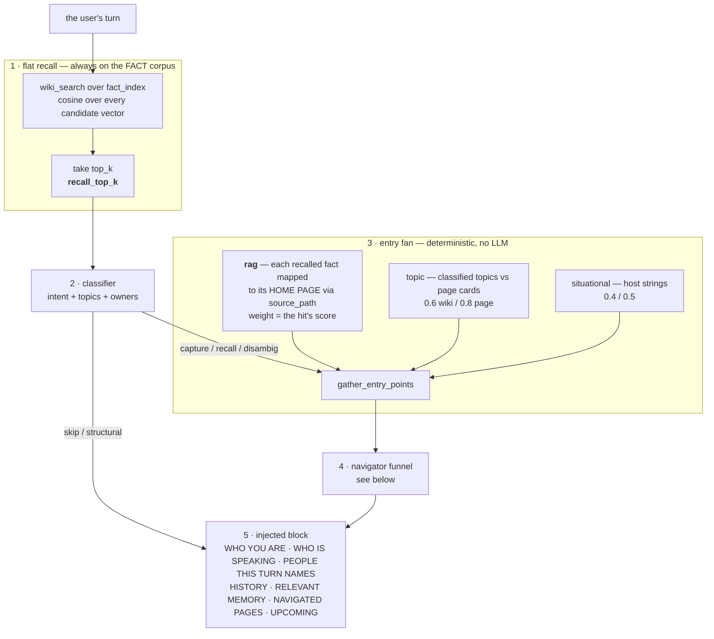
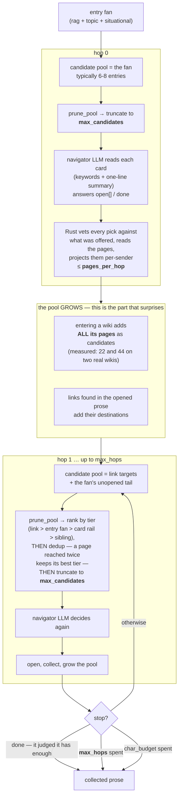

# Recall pipeline

> # 🚨 THE READ SIDE HAS NO CONCEPT OF A WIKI
>
> **Whoever reads the memory does not know wikis exist.** Not the navigator,
> not the funnel, not the fan, not any prompt on this side. There is no
> catalogue of wikis, none is rendered, and none is needed.
>
> The reader **arrives on the pages its own facts landed on and travels by the
> wikilinks written on them**. It never picks a container and never enters one.
> A wiki is the WRITE side's instrument: it tells the filer where a fact goes
> and which pages to link, and the quality of that linking is what the read
> side lives on.
>
> **`wiki_id` on a candidate is an ADDRESS, not a place** — the first half of
> `wiki_id/page.md`, exactly as a folder is the first half of a file path.
>
> Two things are still derived per wiki and neither is navigation:
> **visibility**, which is access control (a reader who can read no fact in a
> wiki sees nothing from it — a property of the facts), and the **smart-wiki
> skip**, which is a different storage kind rather than a container.
>
> Founder's ruling, shipped 2026-08-03 (`6322206`). Before it, every hop
> carried a ROOT INDEX — one line per visible wiki, ~13.5k characters per hop
> on the live corpus — and the day before it was deleted it had to be labelled
> *«orientation only, not doors»* because the navigator kept trying to open its
> entries. **The label was the smell; the removal was the fix.** If you find a
> comment, a doc line or a prompt that still says the reader chooses, enters,
> or descends into a wiki, it is stale — correct it, do not implement it.

[`mwe-core::recall`](../../crates/mwe-core/src/recall.rs) hosts the
read-side orchestrators that complement [capture](capture-and-dedup.md).
The module is layered: pure helpers at the top (n-gram + jaccard +
cosine) and the async orchestrators at the bottom.

## The shape of a turn — where each knob acts

Two diagrams, because the single most common misreading is that the recalled
facts decide the navigator's doors. They do — **on the first hop only**.



The section corpus is **not** in this picture: a conversational turn never
scans it. Documentation reaches the turn only through the bounded project-docs
slot, and the whole-corpus `wiki_search` reaches it only behind
[the signpost funnel](#the-smart-corpus-funnel--a-project-opens-on-its-own-description).

### What actually reaches the agent — the block, slot by slot

The pipeline's whole output is a handful of labelled sections. They are
**role-labelled on purpose**: an agent that cannot tell a recalled fact from a
standing directive will eventually recite the directive back to the user, so
memory and instructions never share a field.

| Slot | Filled by | Bounded by |
|---|---|---|
| `WHO YOU ARE` | the agent wiki's abstract + its identity self-facts | `max_agent_identity_chars` (`900`) |
| `WHO IS SPEAKING` | the sender's identity card — their `profile.md`, projected per sender, testata dropped and links plain. **Deterministic**: no walk, no model decision, no page open | `max_sender_identity_chars` (`2 500`, a failsafe) |
| `PEOPLE THIS TURN NAMES` | the same card, for each **other** enrolled person the turn names — gated by `recall::turn_subjects` (a word match on the roster, no model call), projected for the *reader*, and silent when a card's every fact is private to its subject | `max_mentioned_cards` (`2`), each under `max_sender_identity_chars` |
| `YOUR RECENT HISTORY WITH THIS USER` | the agent's own log of what it has done with this person | `max_agent_history_chars` (`1 400`) |
| `RELEVANT MEMORY` | the flat hit-list — promoted facts, then `Recent (not yet consolidated):` for the fresh slot, then `Project documentation` for the docs slot; deduplicated against the navigated pages | `recall_top_k`, `recall_fresh_top_k`, the docs slot's own budget, and — for the **promoted half only** — `relevance_floor` |
| `NAVIGATED PAGES` | sender-projected prose the funnel collected | `char_budget`, and the walk's own stop reason |
| `UPCOMING` | facts whose validity window closes inside the horizon | `due_soon_top_k`, `due_soon_horizon_hours` |

An empty section is omitted, and a turn where every section is empty carries no
block at all rather than an empty scaffold.

**Two things ride their own fields, deliberately outside the block.** Standing
**behaviour directives** go in `rules` — a binding instruction must never be
indistinguishable from a remembered fact. The **cross-consumer recent window**
(`RECENT EXCHANGES ON YOUR OTHER CHANNELS WITH THIS USER`) goes in
`recent_window`: it is the user's live thread from their *other* surfaces, not
something memory recalled, and it expires in hours rather than being stored.

### The read side has no concept of a wiki

**Founder's ruling, 2026-08-04.** *«Chi scrive deve avere una struttura, per
sapere dove mettere i fatti e a quali pagine aggiungerli, in modo che i links
siano fatti bene. Chi legge non ha bisogno di sapere quali sono le wiki, arriva
direttamente sui fatti, e da lì legge tramite i link le pagine collegate — il
gioco è collegarle bene in struttura, per questo esiste la struttura.»*

So the structure is the **write** side's instrument: it tells the filer where a
fact goes and which pages to link, and the quality of that linking is what the
read side lives on. The reader arrives on the pages its own facts landed on and
travels by `[[wikilinks]]`. It is never handed a map of containers.

What that removed:

| Was | Cost | Now |
|---|---|---|
| **ROOT INDEX** — one line per visible wiki with its `_meta` abstract and full topic union, in **every** hop's prompt | ~13.5k characters per hop on the live corpus, ~27k a turn | gone. The day before it was removed it had to be labelled *"orientation only, not doors"* because the navigator kept trying to open its entries — the label was the smell |
| **Wiki-then-page matching** in the seed gatherer | none (inert, see above) | flattened to pages |

What stays, and why it is not the same thing:

- **`wiki_id` on a candidate** is an *address*, the first half of `wiki_id/page.md`,
  exactly as a folder is the first half of a file path. The navigator prompt says
  this outright so the id is not read as a place.
- **Visibility is derived per wiki** (`reader_can_read_in`, `summary_visible`) —
  that is access control, not navigation: a reader who can read no fact in a wiki
  sees nothing from it, which is a property of the facts, not a wiki-level flag.
- **Smart wikis are skipped** — a different storage kind with no cards and no
  link graph, not a container the reader chose not to enter.

### Inside the funnel — where the doors come from, hop by hop



**So the two knobs size different hops.** `recall_top_k` sizes the *fan*, i.e.
hop 0: more recalled facts means more distinct home pages to start from. From
hop 1 onward the doors are no longer the facts' pages at all — they are every
page of the wikis already entered, plus whatever the prose links to. That pool
is set by the corpus's own shape, not by `top_k`, which is why
`max_candidates` has to be sized against **how many pages a wiki has**, not
against how many facts were recalled.

### Every knob, and what it sizes

Operator-settable, `recall:` in `mwe-mcp.config.yaml` and the
`/dashboard/admin/recall-settings` panel (hot-reloaded). **Only resources are
configurable — semantic judgment lives in the `navigator` prompt, never in a
knob.** Defaults come from `IngestPolicy::default` / `NavigatorPolicy::default`.

| Knob | Default | Sizes |
|---|---:|---|
| `recall_top_k` | `10` | the flat slot — how many promoted facts reach the block, **and** how many home pages seed the fan |
| `recall_fresh_top_k` | `3` | the fresh slot (buffered, un-promoted captures); `0` disables it |
| `smart_corpus_floor` | `0.45` | how close a project's signpost description must sit to the query before the merged search may read that project's documentation at all; naming the project bypasses it |
| `relevance_floor` | `0.0` **(off)** | turn-level gate on *rendering* the promoted flat hits — see [the relevance floor](#the-relevance-floor--a-fourth-gate-but-on-rendering-not-on-recall) for why it ships disabled |
| `max_hops` | `2` | navigator depth; clamped to `MULTI_HOP_HARD_LIMIT` (`10`) |
| `pages_per_hop` | `3` | how many candidates one hop may open |
| `char_budget` | `8 000` | total projected prose one navigation may collect |
| `max_candidates` | `16` | how many doors a hop is offered, after tier ranking and dedup |
| `sibling_floor` | `0` **(off)** | how far directory siblings may top a hop's offer up. Off: the listing is not built at all. `usize::MAX` observes what it would have added |
| `max_card_rails` | `8` | failsafe cap on the `[[wikilinks]]` taken off **one** served identity card. The real bound is the tier — a `card` rail sorts below the whole fan |
| `decision_max_tokens` | `600` | cost guard on the per-hop decision JSON, not a quality dial |
| `due_soon_top_k` | `3` | the `UPCOMING` slot; `0` disables it |
| `due_soon_horizon_hours` | `168` (7 d) | how far ahead `UPCOMING` looks |
| `project_docs_top_k` / `_char_budget` | `3` / `3 000` | the project-docs slot, shared by its two entry points and consumed in order |
| `project_docs_signpost_floor` | `0.55` | the second, stricter gate on documentation the classifier explicitly asked for |
| `recent_window_entries` / `_ttl_hours` / `_chars` | `32` / `4` / `1 200` | the cross-consumer recent window — the thread of discourse, deliberately short-lived |

Not knobs, by design — these are **constants with a measurement behind them**,
changed only with a new measurement (`mwe-core::recall`, `mwe-core::recall_nav`):

| Constant | Value | Role |
|---|---:|---|
| `CLOSED_WINDOW_DOWNRANK` | `0.8` | multiplies a fact whose validity window has closed |
| `SUBJECT_COVERAGE_UPLIFT` | `0.15` | multiplies per turn-subject covered beyond the first |
| `WEIGHT_TOPIC_PAGE` | `0.8` | classified-topic seeds |
| `WEIGHT_SITUATIONAL_PAGE` | `0.5` | host-supplied situational seeds |
| `FRESH_CANDIDATE_CAP` | `32` | how many pending buffered captures the fresh slot ranks per turn |

## The two corpora

Recall reads **two** stores, and which one a caller gets is an explicit
choice made by calling a different function — there is no flag that can
be forgotten:

| Corpus | Table | What it holds | Entry point |
|---|---|---|---|
| **Facts** | `fact_index` | Standard-wiki memory: governed claims with per-fragment ACL, supersedence, validity, attribution | `wiki_search` (and everything built on it) |
| **Sections** | `wiki_sections` | Smart-wiki documentation: heading-delimited chunks of pages a smart consumer authored, ACL held per wiki in `smart_wikis` | `search_sections` |
| Both | — | facts always; a project's sections only behind the [signpost funnel](#the-smart-corpus-funnel--a-project-opens-on-its-own-description) | `search_all` |

`wiki_search` returns [`RecallHit`]s and **cannot** return
documentation — the two live in different tables, and `SectionHit` is a
different type. That is the point: the ingest turn, `recall_core_global`,
the recall gate and the eval harness all take the fact corpus, so
project documentation can no longer crowd out personal memory in a
conversational turn. Only the two consumer surfaces whose contract is
"search everything I can see" — `wiki_search` (MCP) and `wiki_navigate` —
reach for the merged view, and on `search_all` that view is itself gated:
see [the smart-corpus funnel](#the-smart-corpus-funnel--a-project-opens-on-its-own-description).

**Size is why the gating matters.** On the reference deployment the two
corpora are not comparable: 1 086 facts / 185 KB of text / 4.4 MB of
vectors against 4 907 sections / 4 713 KB / 20.1 MB. Documentation is
**96 % of the indexed characters**, so an ungated merged ranking spends
its budget — and its scan — there on every turn, whatever the turn is
about.

## The smart-corpus funnel — a project opens on its own description

[`recall::admitted_smart_wikis`](../../crates/mwe-core/src/recall.rs)
decides, **before any section vector is loaded**, which projects a
whole-corpus query may read. The contract is the founder's: *the project
corpus stays out of recall unless the turn is explicitly about a
project.* Two ways in, and nothing else:

1. **The turn names the project** — the same contiguous-token slug rule
   `recall_named_project_docs` uses, no floor. The turn declared its scope.
2. **The project's signpost description clears the floor** — one cosine
   against the one short authored line per project that
   [`signposts`](../../crates/mwe-core/src/signposts.rs) keeps on the
   owner's reserved `projects.md`.

So the decision costs a handful of dot products against authored lines,
not a scan of thousands of sections — and a turn that opens nothing never
touches the 20 MB of section vectors at all.

**It fails closed.** A project with no description, or whose description
the reader cannot see, is **not** admitted; naming it is the only way in.
That is what makes the description load-bearing rather than decorative.
The description is an ordinary `fact_index` row, so its **stored**
embedding is reused (no per-turn re-embed) and its per-fragment ACL is the
gate: a reader who cannot see a project's signpost cannot open its docs,
and cannot learn the project exists. A floor of **0** is the explicit
"funnel off" switch — it admits every readable smart wiki, including the
undescribed ones.

**Where the default comes from.** Measured on the production corpus over
24 probes — 16 ordinary personal turns that must open nothing, 8 project
turns that must open something:

| rule | personal turns wrongly opened | project turns caught |
|---|---|---|
| name only | 0 / 16 | 2 / 8 |
| description ≥ 0.35 | **7** / 16 | 7 / 8 |
| description ≥ 0.40 | 3 / 16 | 4 / 8 |
| **description ≥ 0.45** (`DEFAULT_SMART_CORPUS_FLOOR`) | **0** / 16 | 3 / 8 |
| description ≥ 0.50 | 0 / 16 | 3 / 8 |

No threshold separates the two groups cleanly — the same shape the
project-docs bench found for `DEFAULT_SIGNPOST_FLOOR`. The default is
therefore set where the *contract* points: precision first, at the
highest-recall value that opens nothing on an ordinary personal turn.

The project turns it misses are the ones phrased in a project's **internal
vocabulary** («il player Tizen non parte», «i contenuti sono fermi da 10
giorni») while the description is written in end-user language. That is a
property of the description, not of the threshold: a description that
names what its project is about lifts those turns over the floor. The
funnel is only as wide as the line somebody wrote. Tunable per deployment
as `recall.smart_corpus_floor` (operator panel, hot-reloaded).

End-to-end on the live corpus, 18 probes: **14 of 14 personal turns return
zero documentation** (they returned 95 of 140 slots' worth before), and 3
of 4 project turns open the right project.

### The project-docs slot — two entry points, at two different stages

Facts-only would leave a real gap: ask a **standard** consumer (Telegram,
hermes) *"come funziona questa cosa di AcmeSigns?"* and the engine would
have the answer indexed and never look at it. So the per-turn recall has
two narrow openings. They are **not** equivalent, and that is why they
run at different points of the turn:

| | trigger | what it is | when it runs |
|---|---|---|---|
| [`recall_named_project_docs`](../../crates/mwe-core/src/recall.rs) | the message **names** a project | an instruction — the turn declared its own scope | **before** the classifier, so the docs are in front of it when it decides the intent |
| [`recall_signposted_project_docs`](../../crates/mwe-core/src/recall.rs) | a **signpost** surfaced among the recalled facts | a guess — the memory noticed the project exists | **after** the classifier, gated by the judgement it returned |

1. **The name.** The message's tokens are matched against the `slug` of
   every smart wiki *the sender can read* (`smart_wikis.slug`, mirrored
   from `_meta.md`). No LLM, and no query embedding at all when nothing
   is named. No floor: the turn asked.
2. **The signpost.** A signpost is a fact on the owner's reserved
   `projects.md` ([`signposts`](../../crates/mwe-core/src/signposts.rs))
   saying a project exists; when one comes back in the turn's ordinary
   fact recall, that project *can* be opened. Whether it *should* be is
   the classifier's call — the `needs_project_docs` field of the JSON it
   already returns (see below). Read access is re-checked against
   `smart_wikis`, never inferred from the signpost. Costs one query, and
   only when a signpost actually surfaced.
3. **Selection — scoped, then ranked by both passes.** Only the candidate
   wikis' sections are ranked, which is why this beats a score threshold
   over everything: it answers from the project in play rather than from
   whatever scored well somewhere. Within that scope the cosine ranking is
   fused with exact-term search — see [the two
   passes](#the-section-corpus-is-ranked-by-two-passes-fused), including
   why the floor is applied *before* the fusion.
4. **Budget.** `project_docs_top_k` (default 3) and
   `project_docs_char_budget` (default 3 000) bound the slot across
   *both* stages — the second pass gets what the first left. Sections are
   kept **whole**: a hit that would overrun is dropped, never truncated,
   because half a section reads as a broken quote. The budget always
   admits its *first* hit whatever the size (an empty slot is worse), so
   the index-time section cap is what keeps one hit from starving the
   others — see [reindex-pipeline](reindex-pipeline.md).

#### Why the second gate is a judgement and not a threshold

It was built as a threshold first, and measured. `bge-m3` against the
real AcmeSigns corpus (2 112 sections at the current chunk policy), best
cosine per turn:

| turn | raw turn | distilled claim |
|---|---|---|
| «stasera ceniamo alle otto da mia sorella» | 0.427 | 0.490 |
| «cosa ho fatto di lavoro questa settimana?» | 0.494 | 0.525 |
| «domani alle 17:00 devo andare da questo cliente che ha il display che non funziona» — must **not** dig | **0.608** | **0.622** |
| «mi ha chiamato un cliente che dice che i contenuti sono fermi da 10 giorni» — must dig | 0.602 | 0.586 |
| «come fa acmesigns a inviare i contenuti ai display?» | 0.651 | 0.627 |

On a 17-sentence bench (6 must-dig, 5 must-not sharing the same
vocabulary — invoicing, a payment instalment, a bracket, a desk monitor)
**no similarity signal separated the two groups**: raw turn A [0.515,
0.602] vs B [0.515, 0.608]; distilled claim A [0.521, 0.586] vs B [0.523,
0.622]; topics only A [0.482, 0.612] vs B [0.539, 0.564]. Distilling the
claim first *compresses* the range (the dinner control climbs to 0.490)
and makes the worst case worse.

The reason is structural: the question is not *how similar is this text
to the docs* but *would reading the docs help answer this* — a
judgement, not a distance. Two sentences about a client and a screen sit
at the same distance from the corpus whether they concern a payment or a
fault. So the decision belongs to the model
(`[[feedback-no-hardcoded-gates-llm-decides]]`), and it costs **no extra
call**: `needs_project_docs` rides the JSON the classifier already
returns, next to `needs_disambig`.

`project_docs_signpost_floor` (default 0.55) survives underneath as a
cheap backstop — an unrelated turn scores 0.42–0.49, far below it — not
as the discriminator.

The judge was then verified rather than assumed: the same bench replayed
through the shipped rule, on the deployment's own workhorse model, with a
signpost planted in the recall block — **14 of 14 decidable cases
correct**, including the two that no similarity signal could tell apart.
Re-run it after editing that section of the prompt.

**Matching rule.** A slug matches as a **contiguous token sequence**,
never as a substring and never token-by-token. That is what keeps the
trigger safe on a compound slug: `cc-pc-lavoro` fires only on the whole
"cc pc lavoro", so an ordinary Italian message about *lavoro* does not
drag in a project's docs; and `acmesigns` never fires from inside a
longer word. Slugs shorter than
[`MIN_SLUG_MATCH_LEN`](../../crates/mwe-core/src/recall.rs) never
trigger.

**Only the slug — deliberately not the title.** Titles carry generic
words ("Claude (claude2)", "… engineering wiki"); matching those would
fire the trigger on ordinary conversation.

The hits render in their own labelled slot of the recall block
(`Project documentation (reference — never file this as a fact):`, see
[`ingest::format_snippet`](../../crates/mwe-core/src/ingest.rs)), and the
ingest prompt carries a matching REFERENCE, NOT MEMORY rule. Both halves
are load-bearing: an unlabelled documentation paragraph in the recall
block looks exactly like a recalled fact, and the classifier would file
it straight back as a fact about the sender.

**ACL is resolved once per wiki, not once per row.** `search_sections`
loads the `smart_wikis` registry (a handful of rows), keeps the wikis the
sender may read (`owner ∪ shared_with`, the same effective set
[`acl::can_read`] evaluates), and only then loads those wikis' sections.
An unreadable wiki's bytes never leave the DB. A sharing revoke is a
single-row write and closes the read window on the next query.

## The section corpus is ranked by two passes, fused

Sections — and only sections — are ranked by vector similarity **fused
with exact-term search**. Facts are not: they are short authored claims
with per-fragment ACLs, and giving them the same treatment is separate
work, not a wider `IN` clause.

**Why.** An identifier carries almost no meaning for an embedding to
encode, and identifiers are what a decision log, an ADR list, a ticket
trail and a stack trace are made of. Measured on the production corpus
before the index existed: the query `D-006` returned the section of
decision **D-001** (whose body merely cites the string), then an
unrelated changelog entry matching on `D-`, then another wiki's
`ADR-006` — never the section actually titled `D-006`. The same content
asked in prose returned that section first, at 0.68, across a language
boundary. The failure is not a tuning problem; it is the one thing
cosine cannot do.

**The lexical pass.** `wiki_sections_fts` is an FTS5 index over
`wiki_sections`, external-content (`content='wiki_sections'`) so the
bytes live in one place, maintained by three triggers in the schema
rather than by the Rust write path — so the reindex sweep, the boot-time
reconciliation and an operator's manual repair cannot bypass it. Free to
rebuild: 2.5 MB and 60 ms on the 4 220-section production corpus, with no
embedder involved.

- **Tokenization is plain `unicode61`.** It splits `D-006` into `d` and
  `006`, and the query is split the same way, so searching the identifier
  as a *phrase* matches only where those tokens are adjacent. Adding `-`
  to `tokenchars` would keep identifiers whole but weld `well-known` into
  a token a search for `known` could never reach.
- **Every query term is a quoted phrase joined by `OR`**
  ([`sections::lexical_query`]). Quoting makes a malformed expression
  unconstructible and makes a user typing `memory OR nothing` search for
  the words. `OR` because the result is a *ranking* input, not a filter:
  `AND` on a prose turn returns nothing.
- **The heading chain is its own weighted column.** `wiki_sections."text"`
  already begins with the heading, so indexing `heading_path` again
  counts a heading term twice — which is exactly the difference between
  the section that *is* `D-006` and one that *cites* it, and nothing else
  in the row expresses it. Measured on the telaiojs decision log
  (D-001…D-007, each split across 2–4 sections by the chunk cap): **in
  the lexical pass alone**, one column ranked the defining section first
  for **4 of 7** identifiers, two columns for **7 of 7**. The 4.0 weight
  then buys ranks 2 and 3, where it promotes the sibling pieces of the
  same decision over unrelated citations; 10.0 and 25.0 behave
  identically, so the value sits on a plateau. Prose queries do not move.
  *That result is about this pass, not about what a consumer receives* —
  see the definition tier below for what the fusion then does with it.

**Both passes always run.** A gate deciding per query whether the lexical
pass is "needed" would spend an LLM judgement to guard a sub-millisecond
index lookup, would discriminate on a *surface property of the query
string* rather than on the invisible intent
`[[feedback-no-hardcoded-gates-llm-decides]]` was written for, and would
drop the hit silently whenever it answered wrongly. The ranking decides
instead of a switch.

**Only the definition tier crosses the corpus boundary.** Inside the
section corpus both signals rank: the `OR`-joined ranking list and the
`AND`-on-heading definition set. On the **merged** list of `search_all`
only the definition set is applied, because a fact's handle is a
`fact_id` and can never key into a list of `source_path#ord` — so the
ranking bonus there is reachable by one corpus only. Its magnitude
settles the matter: `1/(60 + lexical_rank)` is larger than the entire
span of the vector-rank term `1/(60 + r)` over a list of at most
`2 · top_k`, so a section sharing **any** token with the query outranked
**every** fact whatever the cosines were. Measured on the production
corpus, that inverted 11 of 14 probe queries, once placing a section at
cosine 0.25 above a fact at 0.63. `search_lexical_headings` is the signal
that actually means *"the query names this section"* — the guarantee the
tier was built for — and it is empty on prose (13 of those same 14
probes), so it cannot re-open the same hole.

**Fusion changes the order and nothing else.** The two rankings are not
commensurable — a cosine is a distance in `[-1, 1]`, `bm25` an unbounded
corpus-relative weight — so reciprocal rank fusion (`Σ 1/(60 + rank)`)
keeps only positions and discards both magnitudes. `SectionHit::score`
stays the **cosine**, because three callers read it as one: the signpost
floor is a cosine threshold applied to it, `search_all` merges the two
corpora by comparing it against a *fact's* cosine, and `wiki_search`
serializes it to the consumer in the same `score` field a fact hit uses.
A fused number written there would fail all three with no error and no
failing test.

**A definition outranks a citation — as a tier, not a weight.** Rank
fusion alone cannot separate the section *titled* `D-006` from one that
merely *quotes* the string, because the quoting section is in **both**
lists. Measured on the production corpus right after the fusion shipped:
`D-001` cites `D-006`, led the vector list, and sat two places behind in
the lexical one — `1/60 + 1/62` against the definition's `1/78 + 1/60`,
so the citation stayed first and the defining sections came back at #2
and #3. Checked before writing any code: neither a smaller `RRF_K` nor a
heavier lexical term flips that, because both are monotone in a rank gap
of two. So [`sections::search_lexical_headings`] asks the index a second,
sharper question — which sections carry **every** term of the query in
`heading_path` — and those get a bonus larger than any achievable RRF sum
(`DEFINITION_TIER`). `AND` here, where the ranking pass uses `OR`: a
heading holding every term is the query's subject, a heading sharing one
word with a prose sentence is a coincidence. On a prose query the set
comes back empty and the tier is inert — verified on the live corpus, where
the identifier query returns exactly the two defining sections and a
five-word prose query returns none.

**The floor is applied before the fusion, and that ordering is
load-bearing.** The lexical pass matches on `OR`, so on any ordinary
sentence *something* in the corpus shares a word with it — "has a lexical
match" is not evidence, only a high lexical rank is. If the floor were
waived for lexically ranked sections, «stasera ceniamo da mia sorella»
(best cosine 0.427, floor 0.55, digs nothing today) would start dragging
in documentation because one page contains "sorella". So the floor keeps
deciding **whether** to dig, exactly as measured below, and the fusion
decides only **what surfaces** among the sections that already cleared
it. A turn that *names* its project comes through
`recall_named_project_docs` with floor 0, which is why the founder's
`D-006` case is answered by the pass that can read it literally.

## The orchestrators

| API | Scoring | ACL filter | Bumps recall counter? | Surface |
|---|---|---|---|---|
| `wiki_search` | cosine over embedding | post-fetch via [`acl::can_read`] | ✓ on returned ids (`wiki_search_unrecorded` is the bump-free sibling for measurement paths — the eval harness) | top-K vector search over the **fact** corpus |
| `search_sections` | cosine **fused with `bm25`** by rank; `score` stays the cosine | **pre-fetch**, per wiki, from the `smart_wikis` registry | ✓ on returned `(source_path, section_ord)` positions | top-K over the **section** corpus |
| `search_all` | inherited from both, then the **definition tier only** on the merged list | inherited from both, **plus** the signpost funnel on the section half | ✓ inherited | the merged view for `wiki_search` (MCP) |
| `wiki_facts_for` | constant `1.0` | post-fetch | ✗ (audit/list view) | structured SQL query |
| `wiki_recall` | delegates to `wiki_search` today | inherited | ✓ inherited | semantic recall the LLM ingest uses (stable call site) |
| `wiki_multi_hop_facts` | seed-fact + per-hop `wiki_search` | inherited | ✓ inherited | early multi-hop link resolution; lives in [`recall.rs`](../../crates/mwe-core/src/recall.rs) and returns a `MultiHopOutcome`. Exported and tested, but the agentic chat and `wiki_ingest_message` do not call it yet, pending the cap-10-hop traversal protection that gates the consumer hookup (see [What is intentionally out of scope](#what-is-intentionally-out-of-scope)). |
| `recall_fresh_captures` | cosine over the buffered captures' **staged** vectors (recomputed only when a row has none) | post-fetch via `buffered_visible_to` → [`acl::can_read`] | ✗ (not `fact_index` rows yet) | mid-range "fresh" slot — un-promoted captures, minus any whose originating message the turn is already showing; **ingest path only** (see [The mid-range bridge](#the-mid-range-bridge--the-fresh-slot)) |
| `recall_due_soon` | constant `1.0`, ordered by `valid_to` imminence | post-fetch | ✗ (mechanical time-driven pull — counting it would inflate recency without semantic re-use) | the **due-soon slot**: facts whose validity window closes/fires inside `[now, now + horizon]`, most imminent first — a dated commitment surfaces even when nothing in the turn resembles it. Backed by `fact_index::find_due_between`; `now` is caller-supplied (one clock per turn), the horizon is an operator setting (recall-settings panel); the window reads `valid_to`, which stays the only stored firing time — a separate `remind_at` column was considered for reminder delivery and declined, because a `valid_to` on a day boundary means "a date, no hour stated" and the hour is then a delivery-side policy, not a per-fact datum. Wired into the ingest turn as the recall block's `UPCOMING` slot — pulled on **every** LLM-routed turn (time-driven, no LLM cost), see [ingest-pipeline.md](ingest-pipeline.md#the-recall-block--recalled-memory-the-rules-field-is-separate). |

### The relevance floor — a fourth gate, but on rendering, not on recall

None of the rows above are the last word on what the ingest turn's
`RELEVANT MEMORY` slot shows. `wiki_recall`'s hits still feed that slot,
still seed the navigator's entry fan, and still reach the classifier as
context, **unfiltered** — the floor below touches none of that. It only
decides whether [`ingest::format_snippet`](../../crates/mwe-core/src/ingest.rs)
is allowed to *render* the promoted hits it was handed.

[`DEFAULT_RELEVANCE_FLOOR`](../../crates/mwe-core/src/recall.rs)
(`recall.relevance_floor`) is **turn-level, not per-hit**: measured over 60
real user turns, a real answer's score band and injected noise's score band
overlap too much for any per-hit cut to separate them, but the **best
promoted (non-fresh) hit of the turn** does — `0.5474` on the turn that held
the answer against `0.4306` on the turn whose recall block recited unrelated
noise back to the user. So the gate reads that one number per turn: below
it, none of the turn's promoted hits render (the slot is not opened, not
"trimmed"); at or above it, every promoted hit renders, including ones
individually weaker than the floor. Fresh (un-promoted) captures, the
`UPCOMING` slot, and the project-docs slot are all unaffected by design.

⚠️ **It ships OFF (`0.0`) — the mechanism is built, the number is not
earned.** Its only labelled failure was a turn (`«il volume»`) that was an
incomplete utterance and should never have reached recall at all, and
calibrating a downstream relevance gate on damage caused by an upstream gate
that let an unsearchable turn through is the wrong instrument on the wrong
evidence. The upstream fix is the classifier's `skip` rule; a floor gets a
number only once a *complete* turn is measured doing harm, from the gold set
growing on confirmed misses rather than from a sweep of unlabelled turns.
The operator panel turns it on; `0.45` is the value the distribution
suggested, if one is ever wanted. Full writeup, including the measurement
table:
[ingest-pipeline.md](ingest-pipeline.md#the-recall-block--recalled-memory-the-rules-field-is-separate).

## `wiki_search` step-by-step

1. **Embed** the query via the supplied `Arc<dyn Embedder>`.
2. **Fetch** candidates via [`fact_index::find_by_filters`] so
   structured filters narrow the working set *before* scoring.
3. **Score** every candidate with [`cosine_similarity`] against the
   query embedding, then apply the **validity down-rank**: a hit whose
   window is closed at query time (`valid_to` in the past) has its score
   multiplied by [`CLOSED_WINDOW_DOWNRANK`](../../crates/mwe-core/src/recall.rs)
   — a ranking **signal, never a filter** (the deviating fact is often
   the gold; the closed fact still surfaces, just below the open ones;
   the gold set's `parigi-stato` case is the evidence). Multiplicative,
   so ordering *within* the closed set is preserved; a future `valid_to`
   (an appointment to come) is open and unaffected; the fresh-captures
   slot applies the same rule to buffered windows.
   Then apply the **subject-coverage uplift** — see below.
4. **ACL filter** — drop rows the sender cannot read.
5. **Sort** descending by score, take `top_k`.
6. **Bump** `last_recall_at` + `recall_count_30d` on every returned id
   via [`fact_index::bump_recall_hits`] (one transaction).

### Everything that touches a fact's rank, in the order it applies

The whole ranking is four things, and only the first is learned. Read top to
bottom — that is the order a score is built in:

| # | What | Form | Value | Filter or signal? |
|---|---|---|---|---|
| 1 | cosine of the query embedding against the fact's | the base score | `[-1, 1]`, in practice a **narrow band** — this corpus' 1st and 10th hit of a turn are `0.1026` apart | the whole ranking |
| 2 | validity down-rank (`CLOSED_WINDOW_DOWNRANK`) | ×`0.8` | applied when `valid_to` is in the past at query time | **signal** — the closed fact still surfaces, below the open ones |
| 3 | subject coverage (`SUBJECT_COVERAGE_UPLIFT`) | ×`1 + 0.15 × (covered − 1)` | only when the turn names ≥ 2 subjects | **signal** — no fact becomes unreachable |
| 4 | ACL (`acl::can_read`) | drop | per fragment, post-scoring | **filter**, and the only one — a row the sender may not read never leaves the process |

**Why 2 and 3 multiply rather than add**, and why that is the design and not a
detail: the base score lives in a band ~0.10 wide, so *any* flat term large
enough to matter is large enough to override. A flat `+0.10` coverage bonus was
measured at 97 % of the entire usable range — every covering fact overtook
every non-covering one whatever the turn was about. Multiplying preserves the
trade instead: a fact that covers both subjects **and** is on topic gains more
than one that covers both and is off topic, and ordering *within* each class is
untouched.

**Why ACL is last and is a filter while everything else is a signal.** Rank is
an opinion about usefulness; readability is not negotiable. Keeping them in
different categories means no weight can ever be tuned into a leak, and a hit
count that included unreadable rows would itself disclose their existence.

### Subject coverage — a question about two people wants a fact about both

Cosine alone cannot tell that a turn naming *two* people should be answered
by a fact about *both*. Measured on a real corpus: the fact naming both
people, the right topic and the right occasion ranked **8th at 0.458**,
below a birth date at 0.484. `owner_id`/`allow_ids` decided only *whether*
a reader may see a fact, never *how much it was worth*.

So the score is multiplied by
[`SUBJECT_COVERAGE_UPLIFT`](../../crates/mwe-core/src/recall.rs) (`0.15`)
for every subject of the turn a fact covers **beyond the first** — a fact
covering two of a two-person question scores ×1.15, three ×1.30:

- **The turn's subjects** come from [`turn_subjects`]: the speaker when the
  first person puts them *in* the question, plus every enrolled person the
  turn names. A match against the enrolled roster and its aliases — a set
  lookup, **no model call** — on whole words, so `bobby` never answers for
  `bob`. The first-person list deliberately excludes unstressed clitics:
  in *"**mi** ricordi che macchina ha X?"* the speaker is the **addressee**,
  not a subject, and admitting them would pull their unrelated facts into a
  question about somebody else.
- **A fact's people** come from governance *and* content together —
  `owner`/`allow`/`sender` say who may read it, text and topics say who it
  names. Neither alone is aboutness: the measured answer is owned by one
  person and names the other only in its topics and prose.
- **Free below two subjects.** The per-row scan runs only when the turn
  carries at least two subjects, which is rare — of 141 real turns, **2**
  did. Every other turn pays one comparison and nothing else, so a signal
  built for an uncommon shape costs the common one nothing.

A ranking **signal, never a filter**, exactly like the down-rank above — no
fact becomes unreachable and every fact that surfaced before still surfaces.

**Multiplicative, and that is the design, not a detail.** A flat bonus is
not a weight: dense embeddings compress a corpus' similarities into a narrow
band — on the measured corpus **~0.10 between the 1st and the 10th hit** —
so a flat 0.10 was 97 % of the entire usable range and every covering fact
overtook every non-covering one whatever the turn was about. That is an
override. Scaling restores the trade the signal is supposed to make: a fact
that covers both subjects **and** is on topic gains more than one that
covers both and is off topic, and ordering *within* each coverage class is
preserved — the same reason the validity down-rank above is multiplicative.

Measured, the two forms rank the answer equally well and differ in what
surrounds it: at the same "answer first" outcome the flat form pushed the
*topical* facts out of the block, the proportional one keeps them. Which
matters because the facts that rise alongside — *"X is the son of Y"* — are
**not** noise: a fact relating the two people a turn is about is a valid
door and useful material for composing the answer. **How many facts the
block carries is a different question**, settled by `recall_top_k` and
re-measured after the engine settles, not by making this signal timid.

Order rationale:
- *Filter → score → ACL → top-K* keeps the working set small first
  (cheap), spends CPU on the survivors, then drops the rows that
  must not leave the process. ACL post-filter is mandatory: a hit
  count that included unreadable rows would leak existence.
- **The ACL is also a query predicate now** (2026-08-05, `FactFilters::readable_by`,
  built by [`acl::reader_principals`](../../crates/mwe-core/src/acl.rs)). Scoring
  is a cosine against every candidate's stored embedding, so an unreadable
  candidate used to cost a vector read, a transfer and a decode before being
  discarded — on the path that runs once per conversational turn over the whole
  active corpus. The predicate tests all three read axes (`owner_id`,
  `sender_id`, and the `allow_ids` JSON array), because none of them is
  sufficient alone. The section corpus already worked this way: `search_sections`
  applies the ACL before both scans so an unreadable wiki's bytes never leave the
  store.
- **The post-filter stays, and stays the authority.** The predicate is a
  narrowing optimisation; two spellings of one access rule drift, and the
  failure mode of *this* drift is showing somebody something they were never
  told, so the stricter of the two must always get the last word. A test pins
  the two together across every axis.
- Recall counter bump happens **last**, on the rows actually returned
  to the caller — so a query that gets ACL-filtered out of every hit
  does not inflate counters on rows the caller never saw.

NaN scores from a zero-magnitude embedding (model upgrade dim drift)
sort as "lowest" rather than panicking — the caller sees no signal,
not a crash.

## `FactFilters` shape

`fact_index::FactFilters` (used by both `wiki_search` and
`wiki_facts_for`) supports:

| Field | Semantics |
|---|---|
| `wiki_id` | scope to a single wiki |
| `owner_id` | scope to an owner Principal |
| `fact_type` | scope to a fact-type tag |
| `created_after`/`created_before` | ISO 8601 string-compare range |
| `topics_any` | ANY-match against `topics` JSON array (uses `json_each` from the SQLite JSON1 extension) |
| `valid_at` | the **dated-query selector**: keep only facts whose validity window contains this instant ("what was true on June 4th?") — a filter *by design*, unlike the default down-rank; bounds compare via SQLite `datetime()` so mixed `Z`/`+00:00` suffixes normalize. Surfaced on the `wiki_search` tool as `scope.valid_at`. |
| `limit` | hard SQL `LIMIT`; 0 = no cap |

Tombstoned / superseded rows are excluded by construction — recall is
the read-side primitive, so by definition it returns active rows only.

## The mid-range bridge — the fresh slot

`wiki_search` (and therefore `wiki_recall`) only sees **promoted** facts in
`fact_index`. A standard-wiki capture lives in the
[`capture_buffer`](narrative-buffer.md) until the light dream promotes it, so
material a consumer said but the dream has not yet consolidated is invisible to
topic recall — the **mid-range gap**: a claim said a few turns ago, already out
of the consumer's recent window but not yet a durable fact.

`recall_fresh_captures` closes it. It fetches the pending buffered captures
([`capture_buffer::find_all_buffered`](../../crates/mwe-core/src/capture_buffer.rs),
capped at `FRESH_CANDIDATE_CAP`), ACL-filters each via `buffered_visible_to`,
cosine-ranks them against the query using the **vector staged when the claim
was buffered**, and returns the top `recall_fresh_top_k` as `RecallHit`s
flagged `fresh: true`. No `fact_index` row exists yet, so it does **not** bump
recall counters and the hits carry no published-page offsets
(`region_start`/`region_end` are `None`).

**The vector is stored, not recomputed** (2026-08-05). The slot used to embed
every visible pending capture on every conversational turn — up to
`FRESH_CANDIDATE_CAP` embeddings on the hot path, for bodies that never
change. `capture_buffer` now carries the vector, computed once at buffer time
over the marker-stripped body, and both readers use it: this slot, and
promotion, which was computing the identical thing over the identical text a
second time. Nothing new is spent — one of two duplicate computations was
deleted and the other moved earlier. A row with no vector (recovered by
reindexing the journal, which does not carry blobs; or staged while the
embedder was down) falls back to computing it, which is exactly the old
behaviour.

**It does not repeat what the agent is already reading.** The turn hands the
consumer its own replayed transcript and the cross-consumer recent window, and
a capture extracted from one of *those* messages would arrive twice in one
block — once as the message, once as the fact drawn from it. Each buffered
capture records a fingerprint of its originating turn
(`capture_buffer::origin_fingerprint`), the ingest path builds the set of
fingerprints it is already showing, and a match is skipped.

The suppression keys on the **origin**, not on the age, because age cannot
answer the question: the recent window is bounded by an entry count and a
character budget as well as by a TTL, so on a talkative surface a message
leaves it long before the TTL expires. It also means the slot keeps serving,
untouched, every capture made by **somebody else** — another user's message
was never in this sender's context by any route — which is the case the
mid-range bridge is really for. The closure-topic pass passes an empty set
deliberately: it is hunting for the *targets* of a "forget that" gesture, and a
claim the user made moments ago is precisely what such a gesture closes.

**Scope** — the fresh slot is wired into the **ingest / conversational path
only**: [`wiki_ingest_message`](ingest-pipeline.md) merges it after `wiki_recall`
and renders it under a `Recent (not yet consolidated):` heading in the
`context_snippet`. `wiki_recall` itself stays promoted-only, so the dashboard's
`wiki_recall`-backed flows — whose edit/locate logic assumes published-page
offsets the buffer lacks — are unchanged.

**What it is NOT for.** It is a ranked top-K, so it serves *the most relevant
pending claims*, never a complete set. That is why an explicitly requested
container (a list, a collection) is still written live rather than buffered:
a list added to faster than the dream drains would come back missing items,
and an incomplete list is a wrong answer rather than a partial one. Proposed
and rejected on 2026-08-05 — see
[ingest-pipeline.md](ingest-pipeline.md#narrative-vs-direct-split).

## Entry-point gathering — `recall_nav` (navigation, phase 1)

[`mwe-core::recall_nav`](../../crates/mwe-core/src/recall_nav.rs) computes the
**entry-point fan** for recall-as-navigation: the deduplicated, ordered list
of `(wiki, page?)` places a navigator should start reading for the turn.
`gather_entry_points` is deterministic — no LLM call, no embedding, no recall
counters touched — and draws on three seed families, all content-derived:

| Family | Source | Weight |
|---|---|---|
| **Rag** | the turn's flat-recall hits mapped back to `(wiki, page)` via `source_path` | the hit's score, clamped to `[0, 1]` |
| **Topic** | classified topics matched (case-insensitive substring) against the **reader-relative page cards**, recomputed for the sender (see *Reader-relative cards* below) | `WEIGHT_TOPIC_PAGE` = `0.8` |
| **Situational** | free host-supplied strings (location, occasion), matched like topics; empty until a host sends them | `WEIGHT_SITUATIONAL_PAGE` = `0.5` |

**Every seed is a page.** `EntryPoint::page` is a `PathBuf`, not an
`Option` — there is no wiki-level door, so a seed that can only name a wiki
produces nothing at all. Three hits therefore seed no door and reach the turn
through the flat slot instead: a `fresh` capture (no published page yet), a hit
homed on the channel-only `rules.md` (roadmap 41e), and a hit homed on the
wiki's `index.md` (the map — see *Link grammar* below).

### There is no identity family, and that is the fix

A fourth family used to exist — **Principal**, the identity wikis of the people
in the turn, seeded at the wiki level and offered unranked. It was deleted on
2026-08-03, with `WEIGHT_PRINCIPAL` and `EntryOrigin::Principal`, and the
reason is worth keeping because it is a design rule, not a tuning result.

A **fixed** weight cannot be compared with a **measured** one. Over 141 real
turns the corpus' single best fact for a turn scored below `0.6` on 87 of them,
so at `WEIGHT_PRINCIPAL = 0.6` every identity door outranked every fact-derived
door on nearly two turns in three — whatever was asked. Identity pages took
**330 of the 419 opens at the first decision (79 %)**, 186 of them group
directories, while the page holding the answer sat offered and unopened.
Lowering the constant would have moved that number without changing its kind.

Nothing was lost by removing it, because identity now reaches the turn by a
route that costs no navigation at all: `WHO IS SPEAKING` serves the sender's
`profile.md` deterministically on every turn, and `PEOPLE THIS TURN NAMES`
serves the card of each other person the turn names. Measured after the change:
the first decision went from **79 % identity pages to 19 %**, content opens
from **21 % to 81 %**, and opens on the sender's own card from **132 to 0**.

The sender's own card is additionally passed to the funnel as **already
delivered** (the `Served::pages` argument, described under *Wired into the
ingest turn* below), which closes the wikilink route to it as well — the block
already holds that prose. A *subject's* identity page stays an ordinary door:
it is reached like any other page, by a hit on it, by its own card matching, or
by a `[[wikilink]]`.

**Groups seed no door either.** `principal` once meant "any wiki tied to a
principal", which swept in the sender's group memberships and each owner's
groups. A group root is a directory (`page_type: group_theme`, a members list,
links to every child), it holds one identity-core fact against a person's
fifteen to twenty-two, and it contributed roughly 40 candidates every time it
was opened against a pool cap of 16. On the measured corpus `famiglia`'s root
was opened at the first decision on 137 of 141 turns, effectively always,
whatever was asked. Its real value is **routing** — deciding where a fact
belongs — and routing has two proper consumers already: the ingest classifier
(which reads `available_wikis` and the group scopes) and REM. A group wiki is
still reachable as *content*, through its pages.

*Consequence for `wiki_navigate`:* a caller that names a group in `owners`
(seed rung **C**) gets no group-root door either — the same rule applies at
both call sites. Its pages are still reached through the query's own flat hits
and their cards.

Three invariants:

- **A door is described by its own page's card, never by its wiki's.** Every
  candidate the funnel offers — fan, rail, card rail, sibling alike — carries
  the destination page's testata `description` and that page's reader-visible
  topics (`reader_page_card`). This was not true of the fan until 2026-08-04:
  `initial_pool` reached for the *wiki*-level abstract, left over from when a
  seed could still name a wiki alone, so N hits inside one wiki arrived as N
  candidates carrying **one identical sentence and one identical keyword
  union**, separable only by their file name. Since the card is the sole input
  to every choice the funnel makes, that was the fan handing the navigator a
  constant. A page with no `description` now offers none rather than borrowing
  its wiki's — an honest blank is a signal for
  [62](../../planning/62_rem-rumination.md)'s card pass; a wrong sentence is
  not.
- **Reader-relative cards.** Topic/situational seeds match a card recomputed
  per turn for the sender by `meta_annotate::build_reader_card`: the union of
  `topics` over the facts in a wiki (and on a page) the sender can read
  (`acl::can_read`), **not** the owner-tier `_meta`/testata keywords the
  [keyword sync](narrative-compiler.md#keyword-sync--fact-topics-into-_meta-and-the-page-testate-recall-navigation)
  writes into the `.md` for the operator's Obsidian view. So a fact the sender
  cannot read never contributes its theme — a restricted fact's topic words can
  neither act as an entry-point nor surface in the candidate cards the
  navigator LLM sees. This is the serve-time enforcement of the
  [ACL card boundary](../concepts/identity-and-acl.md#the-acl-card-boundary--what-card-metadata-may-carry):
  the compile-time `.md` card stays owner-tier, the served card is reader-relative.
  The wiki's one-line abstract (`summary`/page `description`) is gated separately —
  served only to a reader whose read-set covers the wiki's default visibility
  (i.e. matches its resolved `scope`).
- **Only readable wikis seed.** A wiki the reader can read no fact in
  surfaces nowhere — it never seeds. This is *derived* from the same
  reader-relative card: `build_reader_card` populates
  `ReaderCard::readable_wikis` from every `fact_index` row the reader
  `can_read`, and the gatherer skips any wiki absent from that set. There
  is no wiki-level visibility flag — see
  [`../concepts/identity-and-acl.md` §5](../concepts/identity-and-acl.md#5-wiki-visibility-is-derived--there-is-no-wiki-level-access-gate).
- **Smart wikis are excluded from the funnel entirely** — they are free
  markdown pushed by the consumer, with no synced testata cards, no
  `[[wikilink]]` graph, and wiki-level (not per-fragment) ACL, so there is
  nothing for the funnel to hop through. They are dropped from `infos` in
  `gather_entry_points` (no seed family reaches them) and from the navigable
  `by_id` map in `navigate` (never a candidate, sibling, or link target).
  Smart content is reached via flat recall instead (cf. the REM cross-wiki
  refile sweep, which likewise skips smart). This holds for both call sites —
  the ingest navigator and the `wiki_navigate` tool below.

Duplicates collapse on `(wiki, page)` keeping whichever copy would have sorted
first — `fan_order` settles the collision and then sorts the survivors, so a
door two families found is ranked by its **best** route.

**Matching is per page, with no wiki-level step.** Until 2026-08-04 a needle
was matched against the wiki's topic union first and descended into its pages
only on a hit. That gate could not actually hide anything —
`build_reader_card` derives the wiki union and the per-page unions from the
*same* reader-visible fact set, so a wiki card matched iff one of its page
cards did — but it shaped the code as though the reader navigated containers.
It does not: see *The read side has no concept of a wiki* below.

The fan feeds the **navigator funnel** (`recall_nav::navigate`): a
Rust-owned loop where the `navigator` LLM slot (strong-but-cheap tier — see
[the config schema](../protocol/config-schema.md)) decides, one completion
per hop, which candidate pages to open and when to stop. The division of
labour is strict — **semantics in the prompt, resources in the knobs**:

- The bundled, operator-overridable prompt
  ([`prompts/navigator.md`](../../crates/mwe-core/prompts/navigator.md))
  owns link choice and the stopping judgment ("would a careful assistant be
  embarrassed to act without this page?"). There is **no link-interestingness
  heuristic in Rust**.
- `NavigatorPolicy` owns the resources: depth dial (`max_hops`, clamped to
  the hard hop cap), `pages_per_hop`, total `char_budget`, `max_candidates`
  per hop, decision token cap. Conservative defaults, overridable per
  deployment from the **operator recall-settings panel**
  (`/dashboard/admin/recall-settings`, hot-reloaded) backed by the
  [`recall:` config section](../protocol/config-schema.md#recall); the
  dogfood tunes the values.

Per hop the navigator receives the turn, the prose collected so far, and a
numbered candidate list with **reader-relative cards** (topics the sender can read, abstract gated to default visibility — the
same `build_reader_card` projection as the seeds); it answers one strict JSON
object (`open[]` / `done`). Rust then vets every pick against the offered
candidates (a hallucinated target is discarded, never opened), reads the page,
drops the testata, and **projects it per-sender** (`render_for_sender`) — the
navigator never sees a raw ACL marker. Opening a page grows the next hop's
candidates: the destinations reachable via `[[wikilinks]]` from the collected
prose (`Visible`-only) — a page hop offers the linked **page directly**, a bare
wiki hop offers that wiki's **foundation page** (`profile.md`, else `notes.md`)
and never its map, each with the same reader-relative card (see the link
grammar below). The wiki's *other* pages are not added — see the directory
listing below.

Before the next prompt is built, `prune_pool` **stably ranks the pool by
tier**, drops already-visited / duplicate candidates, **rations the
siblings**, and truncates to `max_candidates`. The four tiers, in order:

| Tier | Origin | What it is evidence of |
|---|---|---|
| 0 | `link` | a `[[wikilink]]` on a page **the navigator chose to open** for this turn — the turn's own judgement, twice |
| 1 | `rag` · `topic` · `situational` | the entry fan, still unpicked, in the gatherer's weight order — the question itself |
| 2 | `card` | a `[[wikilink]]` on an identity card **served unconditionally** — the person, never the question |
| 3 | `page` | a directory sibling — **empty in the default configuration** |

Tier 2 is the newest and its position is the whole design. A served card
arrives on every turn whatever was asked, so its links describe a
neighbourhood, not a need; ranked with the rails they would put the sender's
whole social graph ahead of the pages the question actually found, which is
the shape of the regression [69b](../../planning/69_identity-seed-family.md)
removed. Below the fan they can only consume slack the content doors left, and
`max_card_rails` (`8`) is a failsafe against one over-wired card, not a
policy.

**The directory listing is OFF** (`sibling_floor = 0`; founder, 2026-08-04:
*«io credo sia meglio toglierle del tutto»*). It was the funnel's structural
breadth channel — on first entry into a wiki, every one of its pages was
offered — and it was by a distance the largest producer in the funnel:
`carol` alone contributed 47 candidates on entry, and **98.2 % of everything
the cap cut was siblings** (card 66 §7.2).

What retired it was asking *how the survivors are chosen*.
[`wiki::list_wiki_pages`] sorts by path, so the ones that fit were the
**alphabetically first** — not a choice, an accident of filenames — and each
one offered costs a summary-and-keywords line in every hop's prompt. Paying a
per-hop tax to offer arbitrary pages is worse than offering nothing.

**So reachability now rests entirely on the four content-derived channels**: a
fact hit (`rag`), a topic or situational match against the page's **own card**,
and an authored `[[wikilink]]`. A page that has none of those is reachable only
through the flat slot. That is the same argument that makes the page cards
load-bearing rather than decorative — they are the sole input to every choice
the funnel makes, and now to reachability itself.

The knob survives the code being off: it is one number to restore if the
post-deploy dead-end rate says the corpus is not ready for it, and
`examples/pool_shape.rs` sets it to `usize::MAX` to measure what the listing
*would* have added. Above `0` it is a floor, not a quota — siblings top the
offer up to it and never go above.

**The ranking runs before the dedup, and that order is load-bearing.** One
page routinely reaches the pool by two routes at once: a page linked from
the prose just read is, whenever it lives in the wiki the funnel has
entered, *also* one of that directory's siblings. The two copies are one
destination at two very different tiers, so the dedup has to keep the
**best** route, not the earliest — and the earliest is always the sibling,
because `open_target` lists the directory before it reads the links. It is
the same rule `dedup_and_sort` applies to the fan, where the copy that
sorts first wins a collision.

Measured over 141 real turns on the live corpus: the cap bites on **49 % of
hops**, and once the ranking precedes the dedup **1 628 of 10 955 offered
candidates (14.9 %) change tier** — 1 442 of them from filesystem sibling to
authored rail, leading the pool instead of being cut with the tail.

### Why a walk stopped — the seven `NavStop` reasons

Every navigation records exactly one, journaled in the recall trace and in the
`recall_nav: navigation done` log line. Reading them is how a disappointing
answer is diagnosed without re-running anything: they separate *the funnel
chose to stop* from *the funnel ran out* from *the funnel broke*.

| `stop` | Meaning | Reading |
|---|---|---|
| `done` | the navigator judged the collection sufficient | the intended exit |
| `hop_cap` | `max_hops` spent | it still wanted to walk — the depth dial is the binding constraint |
| `budget` | `char_budget` spent | the pages were long, not the walk deep |
| `pool_exhausted` | every remaining candidate was already visited or vanished | the corpus ran out of doors, not the policy |
| `empty_fan` | nothing seeded the walk | **no completion was spent** — recall never started |
| `nothing_opened` | every pick of the hop was vetted away | the model named doors that were not offered; another hop would replay it |
| `llm_degraded` | transport failure or an unparseable decision | partial recall, and invisible where it lands — see the single retry in `request_decision` |

Degradation contract: an LLM failure or an unparseable decision stops the
funnel and returns the partial collection — recall degrades, the turn
survives. An empty fan returns empty without spending a completion.

## Link grammar

Wikilinks are the **navigator's rails** — the memory wiki links pages so
recall-by-navigation can walk them. Humans click the same links in the
**dashboard memory explorer** ([dashboard-memory-mvp.md](dashboard-memory-mvp.md)
§Wiki view); resolvability in any external markdown viewer is a non-goal.
One canonical grammar — **a rail names a page** — plus a legacy form that is
resolved but never minted, and a presentation alias:

| Form | Meaning | Example |
|---|---|---|
| `[[wiki_id/page-slug]]` | **page hop** — one page of that wiki; the slug is the page file's stem (no `.md`), and may itself contain `/` for a nested page | `[[famiglia-bruno-battaglia/referto_oculistica_bruno_2026_02_11]]` |
| `[[wiki_id]]` | **legacy wiki hop** — resolved to that wiki's **foundation page** (`profile.md`, else `notes.md`), *never* its map; dropped when the wiki has neither. Not minted and not taught | `[[famiglia]]` → `famiglia/profile.md` |
| `[[target\|display]]` | either form with a **display alias** — presentation only, stripped before resolution; renders as the label | `[[famiglia/profile\|famiglia]]` |

Wiki ids are **flat** (`famiglia-bruno-battaglia`), never directory paths —
the id is the address, the tree position is the tree's business.

**Why the bare form is legacy.** It once meant "the wiki's overview", and the
overview was `index.md`. Since [63 §8](../../planning/63_navigator-drift.md)
`index.md` is the **map** — written for REM and the filing classifier, refused
by `open_target` and by all three offer-side filters — so every bare rail in
the corpus pointed at a page no reader may open. They are not rare: `[[franz]]`,
`[[carol]]`, `[[bob]]` and their kind are **40 % of the links written on a
content page** in the live corpus. What the prose means by `[[franz]]` is *the
person*, and since the same split the person is `profile.md` — so the funnel
resolves the bare form to the wiki's foundation page and the rails survive a
rename we performed ourselves. The writer is taught the page form only
(`cronista.md` v1.19), and `compiler::plan_page_wikilink` cannot mint the bare
one; the founder's rule is that **the map has outgoing links and no incoming
ones** (2026-08-04).

**Legacy fallback — emit canonical, resolve legacy** (the same stance the
[marker grammar](marker-grammar.md) takes on the full inline marker): a
bare target that names no wiki is retried as a **page slug over the whole
tree**, in deterministic order — the wiki the prose belongs to, its
ancestors nearest-first, its sub-wikis nearest-first, then the remaining
wikis in id order. The pre-canonical corpus links pages by bare name across
wiki lines (`[[cucina]]` on a `famiglia` page names an `morgana` page; a
sub-wiki page names its parent's dossier stub), and page prose is copied
verbatim across compiles, so those rails never self-canonicalize.
Precedence is deterministic: a wiki id always wins over a same-named page,
and a link resolves to the same destination for every reader (visibility
gates apply at the destination, they never re-route the link). What still
matches nothing (an underscored restyling of a wiki id, a slug-as-directory,
a slug with no page behind it anywhere) is a **dead rail**: the navigator
drops it, the dashboard leaves it as plain text — never a broken link.

Two consumers resolve the grammar:

- **The recall navigator** — [`recall::extract_wikilinks`](../../crates/mwe-core/src/recall.rs)
  parses both forms (alias stripped) out of collected prose;
  `recall_nav::linked_wiki_candidates` offers the linked wiki (its `_meta`
  card) for a wiki hop and the linked page itself (its testata card) for a
  page hop — one hop to the addressed destination, no forced descent through
  the wiki root — with the legacy bare slug resolved in the tree order above
  (`recall_nav::resolve_bare_slug_wiki`). Candidates stay reader-gated
  (`reader_can_read_in`) and a
  page hop is vetted against the filesystem before it is offered —
  Obsidian-style (`wiki::resolve_page_case_insensitive`): byte-exact
  first, else the unique ASCII-case-insensitive match, so a link whose
  case drifted from the filename resolves the same way it does on the
  consumer's local mirror instead of dying as a dead rail. The
  wiki-granular projection `extract_wikilink_wiki_ids` backs the structural
  hop graph (`wiki_multi_hop_facts`) and the REM back-pressure/backlink
  sweeps.
- **The dashboard click-through** — the memory explorer's rendered page view
  and the fact record's rendered body linkify both forms (legacy fallback
  included, resolved against the page's / the fact's own wiki) into
  in-dashboard navigation, alias as the label, dangling target as plain text
  ([dashboard-memory-mvp.md](dashboard-memory-mvp.md)).

Every mechanical emitter writes the canonical forms —
`capture::wiki_link`, the document-ingest dossier anchor, the smart-push
`authored_refs`, and the compiler feeds
(`compiler::plan_page_wikilink`: the starvation index, the recommended
links, the Hub Writer children — a page hop everywhere, and `None` for a
wiki's own `index.md`, so a plan node still sitting on the map contributes no
link at all rather than a dead one). The prose-writing prompts
(`cronista`, `regenerate-index`) carry the copy-verbatim instruction: a
model never mints or restyles a link target. There is no mechanical corpus
rewriter — the verbatim-copied legacy links simply stay navigable through
the read-side fallback above.

**Wired into the ingest turn** as the recall block's `NAVIGATED PAGES`
section: the funnel runs **after** the classification, reusing its
`topics`/`owner_id`s as gather seeds (the Step-1 flat recall stays the cheap
seed and classifier input — «RAG for the entrances»), only for intents that
justify the LLM spend (capture / recall / disambiguation), and only when the
call site wired the optional `navigator` backend. The reserved `rules.md`
policy page is never a door (channel-only — the fan skips it, a RAG hit
homed on it seeds nothing, and the open step discards it as a fail-safe).

**The ingest turn also hands the funnel the pages it has already delivered**
(`navigate`'s `Served` argument): the sender's identity card, served in full
by `WHO IS SPEAKING` on every turn, plus every card `PEOPLE THIS TURN NAMES`
served. `Served` carries them **twice, by two keys**, and the second is not
redundant:

- `Served::pages` — `(wiki_id, page)`, which closes the page against re-reading;
- `Served::cards` — `(wiki_id, projected markdown)`, which keeps what is
  *written on it* usable. A served page never reaches `open_target`, and
  `open_target` is the only place `[[wikilinks]]` are harvested — so before
  2026-08-04 a card's own rails reached the funnel by **no route at all**.
  That is the tier-2 `card` channel above, and it matters more since
  [69c](../../planning/69_identity-seed-family.md) gave the card a
  ~1800-character ceiling whose entire purpose is to push its detail onto
  linked pages. The text is the **projected** card, so a link inside a region
  this reader may not see is gone before it can become a door.

They enter
the walk as if it had opened them, so they are never offered as a candidate,
never opened, and never charged to the character budget — the guarantee holds
on every route in, because it is the one `visited` set that `prune_pool`
filters by and `open_target` refuses on. **So `index.md` is not a navigation
destination for its own owner**: its prose is in the block whatever the
navigator does, and the founder's ruling (2026-08-03) is that the hub's
routing is not needed when the recalled facts already name the pages that
answer the turn. A *subject's* identity page is untouched by this — nothing
has served it. `wiki_navigate` passes nothing: it builds no block. The
assembled role-labelled `context_snippet` (`WHO YOU ARE` → `WHO IS
SPEAKING` → `YOUR RECENT HISTORY WITH THIS USER` → `RELEVANT MEMORY` →
`NAVIGATED PAGES` → `UPCOMING`) is documented in
[ingest-pipeline.md](ingest-pipeline.md#the-recall-block--recalled-memory-the-rules-field-is-separate).

## Consumer-facing deep recall — the `wiki_navigate` tool

The same funnel is also exposed as a callable MCP tool, `wiki_navigate`
(family D — see [mcp-tools.md](../protocol/mcp-tools.md)), so a consumer that
searches **explicitly** (any smart consumer; the web one in particular, which
gets no per-turn injection) reaches deep recall, not just flat top-K. It is the
**deep counterpart of `wiki_search`** (whole visible corpus, ACL-filtered), and
returns the **navigated fragments with their `(wiki, page)`** (the path that
built the context) **plus** the flat hits — depth is a superset of breadth, so
the consumer never needs to call both. It degrades to flat-only when no
`navigator` slot is wired (`navigator_available: false`).

The standard consumer is **not** taught this tool: its deep recall is the
automatic ingest injection above, and it keeps `wiki_search`/`wiki_read` as its
flat explicit escape hatch. The tool is not class-gated (whole-corpus +
ACL-filtered is safe for any caller) — this is positioning, not a gate.

Seed cascade (the tool has no classifier in the loop, unlike ingest): the
caller's explicit `topics`/`owners` win (**C**); else a small dedicated
extraction over the query on the `navigator` slot
(`recall_nav::extract_query_seeds`, prompt
[`prompts/query-seeds.md`](../../crates/mwe-core/prompts/query-seeds.md);
every extracted entity kept as a topic needle whether or not it resolves)
(**B**); else the RAG seeds alone (**A**). Each step degrades to the next.

## Recall traces — the route journal

[`mwe-core::recall_trace`](../../crates/mwe-core/src/recall_trace.rs) journals
the **whole route** a recall took, so the operator can finally see *why* a
fact did or did not surface. Two producers write it:

- the **ingest per-turn injection** — `wiki_ingest_message` records every
  LLM-routed turn (and the ephemeral guest turn) right after the recall
  block is assembled;
- the **`wiki_navigate` tool** — the MCP handler records each run, with the
  consumer id from the token.

One row per run in the `recall_traces` table (migration `0057`): stamp,
source (`ingest` | `navigate`), sender, and a **versioned JSON payload**
(`RecallTrace`, every field `serde(default)` so older rows keep decoding).
The payload carries the turn text (capped), the classification seeds and
where they came from (`classifier` / the `wiki_navigate` cascade rungs /
`guest`), the flat / fresh / due-soon hits (score, page, byte region,
capped body), the entry-point fan (family + weight), the **funnel journal**
— per hop: the candidate cards exactly as offered, the decision (`open[]`,
`done`, and the navigator's own one-line `note`, which the Rust binding now
captures), the vetting outcome of every pick, the opened pages (chars,
excerpt, links discovered) — the stop reason ([`NavStop`](../../crates/mwe-core/src/recall_nav.rs):
`done` / `budget` / `hop_cap` / `llm_degraded` / `nothing_opened` /
`pool_exhausted` / `empty_fan`), the budget spent, and the **injected block
verbatim** (`context_snippet` + the `rules` field on ingest; the result
payload on `wiki_navigate`).

The funnel's own half lives in [`NavigationOutcome::trace`](../../crates/mwe-core/src/recall_nav.rs)
(`Vec<HopTrace>` + `stop`), populated on every `navigate` run — string
clones only, no extra I/O or LLM cost. Recording is **best-effort
telemetry**: a journal failure logs a warning and never touches the turn.
The journal is **age-pruned** after each insert, on the same idiom as the
`recall_log` / `recall_misses` siblings: rows past `recall.trace_retention_days`
(default `DEFAULT_TRACE_RETENTION_DAYS` = 90; `0` disables the prune) are
deleted. `tool_executions` remains the audit surface.

**Why a window rather than a handful of rows.** The journal is the only
labelled record the engine produces of *how recall behaved* — the candidates
offered per hop, the navigator's own reason for each choice, and what it then
opened. That is the evidence base a rewiring pass reads (a page repeatedly
offered and declined has a card that misdescribes it) and the raw material a
growing gold set is distilled from. Keeping ten rows discarded better than
99 % of it within the hour on a deployment doing a few dozen turns a day.
The counterweight is that a trace holds the recall block verbatim, so the
window is also how long clear-text recalled memory sits in the engine DB —
which is why it is an operator setting and not a constant.

The dashboard
surface (journal list + the animated 3D replay viewer) is open to
[every signed-in user](dashboard.md) and **scoped to the reader's own
recalls** — a trace belongs to the sender it was recorded for, so reading
your own is transparency about the answer you were given rather than
operator telemetry. Widening it to the whole deployment is
[admin reveal](redaction-policy.md#dashboard-admin-reveal), the one switch,
because a trace does cross wiki and ACL lines by construction.

## The recall eval harness — `recall_eval`

[`mwe-core::recall_eval`](../../crates/mwe-core/src/recall_eval.rs) turns
"navigation beats flat RAG" from an anecdote into numbers. A YAML **gold
set** is replayed against a workdir; both paths run exactly as the ingest
turn runs them (flat = `wiki_search`; navigation = gather → navigate with
the flat hits as RAG seeds) and are scored by case-insensitive substring
containment of the **expectations**:

```yaml
queries:
  - id: galadriel-dinner            # optional label
    query: cosa cucino stasera per gli ospiti?
    sender_id: alice
    topics: [cucina]                # optional classifier-style seeds
    owners: ["user:galadriel"]      # optional
    expect:                         # ground truth: snippets recall MUST surface
      - celiaca
      - senza glutine
```

| Metric | Meaning |
|---|---|
| **hit@1 / hit@3** | flat baseline: ≥ 1 expectation in the top-1 / top-3 hit texts |
| **coverage** (per path) | fraction of expectations found anywhere in that path's output |
| **deviating** | expectations navigation surfaced that flat similarity missed — the metric the navigation design exists for |
| **combined / missing** | union of the two paths / expectations neither surfaced |

Measurement discipline: the flat pass uses `wiki_search_unrecorded` (no
recall-counter bump — synthetic queries must not inflate the corpus's
recency signal) and the harness takes no lockfile (read-only, safe next
to a live `serve`). CLI: `mwe-mcp recall eval --gold <file> [--flat-only]`
([build-run.md](../development/build-run.md)); knobs come from the
[`recall:` config section](../protocol/config-schema.md#recall). The gold
set itself is **filled by the dogfood** on real material — the harness
ships first so the queries can be captured as they come up.

## The hindsight log + the judge-free miss signal

Self-correcting REM's detection floor
([`mwe-core::recall_log`](../../crates/mwe-core/src/recall_log.rs),
migration `0058`): the system notices, from the user's own behaviour,
when recall **failed to surface a fact it already held** — no LLM verdict
anywhere in the signal.

- **The hindsight log** (`recall_log`, one lean row per LLM-routed ingest
  turn): the fact ids the turn surfaced (flat + fresh + due-soon hits)
  and the navigated pages' workdir-relative source paths. Written
  best-effort at the end of the turn; age-pruned (30 days). Freshly
  buffered captures get the row's id stamped on them
  (`capture_buffer.recall_log_id`) so the offline half below can look
  back at the turn that produced them.
- **The miss signal**: when the write-time dedup
  ([`capture::best_dedup_candidate`]) skips a capture as a restatement of
  an existing fact X, the user just re-said something memory knew — if X
  was also absent from that turn's surfaced set (not a hit, not on a
  navigated page), recall demonstrably missed it, and one `recall_misses`
  row lands (fact, home page, dedup score, the restatement, the turn's
  log row; 90-day prune). Detected on **both dedup surfaces**: the direct
  capture path checks in-memory at the end of the same turn; the light
  dream's promotion fold checks the buffered capture's logged turn.
  Rules-page facts are out of scope (channel-delivered, never recalled
  memory).

Both tables are telemetry-class (every writer best-effort, resource-cap
pruned). Their consumer is the REM
[recall-repair sub-job](rem-cycle.md#recall-repair-sub-job--self-correcting-rems-repair-stage):
each pending miss is judged for a re-file repair that commits **only**
through the gold-set gate
([`mwe-core::recall_gate`](../../crates/mwe-core/src/recall_gate.rs)) —
the candidate move is applied to a scratch snapshot and must make the
missed query surface its fact without regressing the deployment's gold
set (`<workdir>/recall-gold.yaml`, this harness's YAML shape). Every
real miss also lands as a **candidate** gold case in
`<workdir>/recall-gold-candidates.yaml` — the operator reviews, distils
the expectations, and merges them into the gold file by hand: the loop
that grows the judge from the system's own confirmed failures, without
ever letting an unreviewed case *become* the judge.

## ACL projection

Every orchestrator routes through `row_visible_to(row, sender)`,
which builds an `Acl { owner: Some(row.owner_id), allow:
row.allow_ids }` and calls [`acl::can_read`] with the row's
optional `sender_id` for the cross-user attribution invariant
(the `sender=` marker rule in
[`identity-and-acl.md §2`](../concepts/identity-and-acl.md#2-block-level-acl-model)).
The check uses bare ids — the
[`SenderContext`] type carries `sender_id: String` (no `user:`
prefix) and `sender_groups: Vec<String>`, mirroring what the JWT
puts on the wire.

The fresh slot mirrors this: `buffered_visible_to(cap, sender)` builds the same
`Acl` from the buffered capture's `owner` / `allow` / `sender` and calls the
identical [`acl::can_read`], so an un-promoted capture is ACL-gated exactly like
a promoted fact.

The `sender_groups` vector is **populated at every production
construction site** via
[`enrollment::groups_for(pool, sender_id)`](../../crates/mwe-core/src/enrollment.rs),
which reads the `enrollment_groups.members` JSON array through a
SQLite `json_each` predicate. The five production call sites are:
the ingest orchestrator
([`wiki_ingest_message`](../../crates/mwe-core/src/ingest.rs) — which
calls the scope-carrying sibling
[`groups_with_scope_for`](../../crates/mwe-core/src/enrollment.rs) and
derives the bare ids from `.0`, so the prompt also gets each group's
`scope` for owner routing; see
[`ingest-pipeline.md`](ingest-pipeline.md)),
the `wiki_search` MCP tool
([`call_wiki_search`](../../crates/mwe-mcp-server/src/mcp/tools.rs)),
the dashboard `/facts` index + open-in-chat handlers
([`routes/facts.rs`](../../crates/mwe-dashboard/src/routes/facts.rs)),
and the dashboard chat agentic loop
([`routes/chat.rs`](../../crates/mwe-dashboard/src/routes/chat.rs)).
The convenience constructor `SenderContext::user(id)` deliberately
leaves the vector empty and is therefore reserved for tests and the
`anonymous()` path.

Tests cover:
- owner-user self vs other
- cross-user attribution (sender = bob captures on alice's wiki ⇒
  bob can read his own region)
- group membership (now wired end-to-end in production via
  `enrollment::groups_for`)
- global owner ⇒ anyone (anonymous + named user)

## Why brute-force cosine for now

Both orchestrators scan every candidate with a flat O(N) cosine loop:
each query reads the candidate rows **with their vectors** and scores
them in memory. There is no ANN index; a `sqlite-vec` integration is not
built today. (The lexical pass is *not* part of this cost — `bm25` over
FTS5 is an index lookup, and it returns identities rather than rows.)

The cost is therefore linear in the candidate count, and the candidate
count is what the corpus split above controls. Measured on a production
store of ~4k active rows with bge-m3 1024-d vectors (≈16 MB of
embeddings): reading the full candidate set costs ~30-45 ms warm, and
observed end-to-end `wiki_search` latency ran ~170-260 ms including the
query embed — up from ~100 ms when the same store held ~1k rows. So the
scan is not the dominant term yet, but it is the term that **grows**, and
it grows fastest with documentation, which is exactly the corpus a
conversational turn no longer scans.

Watch `wiki_search` latency (it is journalled per call in
`tool_executions`) rather than row counts: when the scan starts to
dominate the embed, the `sqlite-vec` work is due. Splitting the corpora
also means the index can be added to one of them first — the section
table is the larger and the more regenerable of the two.

## Test coverage

- Pure helpers: 6 cosine tests (identical / orthogonal / opposite /
  zero / mismatched-dim / empty).
- ACL projection: 4 row-visibility tests (user/cross-user/group/global).
- `score_and_filter`: 3 (descending sort + truncate / ACL drop / empty).
- `fact_index::find_by_filters`: 3 (wiki scope / owner+type combo /
  topics_any with `json_each`).
- `wiki_search`: 4 (top-K by cosine / ACL drop / recall-counter bump
  / top-K=0 returns empty).
- `search_sections`: 5 (cosine ranking + telemetry bump / wiki-level ACL
  across owner, group grantee and stranger / a revoke closes the read
  window with one row write / an exact term outranks a better cosine
  while `score` stays the cosine / a query with no lexical match leaves
  the cosine order untouched).
- Lexical pass, in [`sections`](../../crates/mwe-core/src/sections.rs): 5
  (query building — identifiers stay adjacent, operator words are quoted
  not obeyed, repeats and punctuation collapse, a `"` cannot reach the
  expression, term cap / identifier ranking + wiki ACL + the three empty
  short-circuits / a section *titled* with an identifier beats a shorter
  one *citing* it, which fails without the heading column / the index
  tracks in-place edits and page deletions through its triggers).
- `search_all`: 4 (both corpora merge into one ranking while
  `wiki_search` stays facts-only / `top_k` honoured across the merge / a
  section the query **names** outranks a perfect-cosine fact, and does so
  through the definition tier rather than its score / a section that merely
  **mentions** a query token does *not* evict a better-scoring fact — the
  regression guard for the cross-corpus ranking bonus).
- `admitted_smart_wikis` (the funnel): 3 — a project whose description does
  not match stays shut and its perfect-cosine section never surfaces / the
  description *or* the project's name opens it, the name regardless of the
  floor / it fails closed with no description, a floor of 0 is the explicit
  off switch, and another user's unshared description neither admits the
  project nor reveals it.
- `recall_named_project_docs` + `rank_project_sections`, fusion: 2 (naming
  the project puts its identifier in the single slot / a lexical match
  does **not** lift a section over the signpost floor).
- `recall_project_docs`: 10 — the match rule (case/punctuation
  insensitive, hyphenated slug either spelling / a compound slug never
  fires on one of its words / a slug inside a longer word does not count
  / a too-short slug never triggers); the name path (fires only when the
  message names the project, naming an unreadable project yields nothing,
  the char budget bounds the slot with whole sections and `top_k = 0`
  disables it); and the signpost path (a surfaced signpost opens its
  project with the project never named / the floor keeps a
  weakly-matching turn's slot empty while a *named* project is served
  regardless / a signpost never opens a project its reader cannot see).
- `signposts`: 11 — the write lands on the owner's reserved page carrying
  the project name; an unchanged refresh writes nothing; a new
  description supersedes; the day window rolls; the same day twice
  supersedes; both caps refuse rather than truncate; only the owner may
  signpost; a standard wiki cannot be signposted; read access mirrors the
  project's roster; a malformed day is refused.
- `wiki_facts_for`: 2 (filtered without counter bump / ACL filter).
- `wiki_recall`: 1 (delegates to search today).
- `recall_fresh_captures`: 1 (un-promoted buffered capture surfaces, ACL-scoped, flagged `fresh`; another owner's capture is filtered out).
- `recall_nav` (gatherer): per-family seed tests (topic and situational card
  matches / rag path mapping / the three hits that seed nothing — `fresh`,
  `rules.md`, the map), the per-family ACL-cascade matrix, dedup/sort,
  `page_within`, and `fold_entities` keeping a resolved name as a needle.
- `recall_nav` (funnel, scripted-LLM): vetted open + per-sender
  projection, hallucinated-target discard, wikilink follow-through
  (wiki hop, direct page hop with alias stripped, dead page hop never
  offered), char-budget truncation, soft-fail on unparseable decisions,
  done / empty-fan short-circuits, fence-tolerant decision parse.
- `prune_pool`: 8 — the tier order (a rail leads a sibling / a sibling
  never displaces a fan seed / the cap keeps the highest tiers, not the
  alphabetically-first entries / a sibling-only page still surfaces when
  there is room / the fan's own order survives untouched), **plus the
  collision the first five could not see**: one page reached by two routes
  keeps the better route, a linked page buried in a 30-entry directory
  listing still leads the pool, and a fan seed re-offered as a sibling of
  its own wiki is not demoted. Every one of the original five used
  *different* pages for the two routes, which is how a 14.9 % mis-tiering
  survived a green suite.
- Subject coverage, in [`recall`](../../crates/mwe-core/src/recall.rs): 6 —
  `turn_subjects` admits the speaker when the first person puts them in the
  question and leaves them out when they are only addressed; an alias
  matches but a substring never does; coverage is free below two subjects;
  a fact covering both subjects overtakes a closer one covering one; and
  the signal reorders without ever removing.
- Link grammar: `recall.rs` pins `extract_wikilinks` (page hops kept,
  aliases stripped, trailing-slash and whitespace degenerate forms).

## What is intentionally out of scope

These are not implemented today (planned — see the
roadmap):

| Not yet supported | Why |
|---|---|
| **`sqlite-vec` integration** | Profile-driven. Still fast enough at current size; the signal to watch is `wiki_search` latency, and the corpus split bought headroom by keeping documentation out of the conversational scan. |
| **LLM rerank** | `wiki_recall` stays a stable call site so the ingest LLM can layer rerank on top without breaking signatures. |
| **`recent_messages` weighting** | Accepted as parameter today, ignored; the weighting will use context-cache hooks the ingest LLM owns. |
| **Multi-hop link resolution wired into consumer surfaces** | `wiki_multi_hop_facts` already lives in [`recall.rs`](../../crates/mwe-core/src/recall.rs) with tests, but it is not yet called by `wiki_ingest_message`, the agentic chat, or `wiki_navigate`. The cap-10-hop traversal protection plus the right rerank policy are needed before the consumer hookup. |
| **Aggregate telemetry** (latency histograms, candidate-count distributions) | Only the per-run [recall trace](#recall-traces--the-route-journal) exists (every route inside the retention window, replayable); aggregates and counters beyond `recall_count_30d` are not built. |
