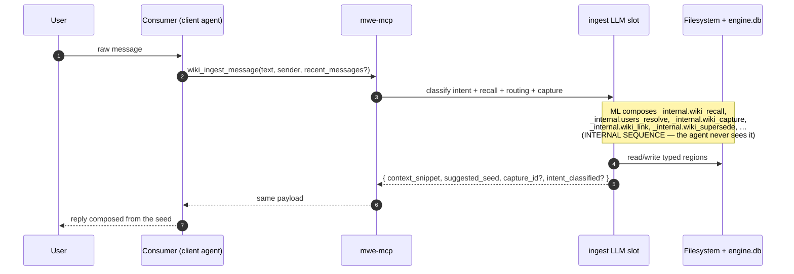

# Worked scenarios

Seven narrative walkthroughs that show how mwe-mcp composes with a
generic consumer agent. Each one keeps the same lens on the camera:
**the external consumer side** (what the client agent actually calls)
sits in front of **the internal mwe-mcp side** (what the server's
`ingest` LLM slot composes out of `_internal.*` atomic operations).
The internal column is shown for teaching value only — it is invisible
to the client agent, which never sees it and never calls into it.

> **Terminology.** Throughout this page "memory wiki" means the
> persistent memory mwe-mcp manages at runtime for a consumer agent
> (the *product*). The "engineering wiki" is the contributor docs you
> are reading now. See `../index.md` for the glossary.

## The one invariant that drives every scenario

A client agent — Claude, Cursor, a Slack bot, a VSCode plugin, a
Telegram openclaw, anything — talks to mwe-mcp through a tiny surface:

- **Every conversational turn** it calls **`wiki_ingest_message(text,
  sender, recent_messages?)`**. This is the single channel of the
  conversational flow. It is always on, never optional. Internally the
  server's `ingest` LLM slot classifies intent, recalls context, picks
  an owner/ACL, and composes the right sequence of `_internal.*` atomic
  writes — all in one round-trip that returns strict JSON (see
  `../the ingest-pipeline design note).
- **For structural intent** — restructuring,
  changing a wiki's scope, restoring something archived — the agent
  calls **`dashboard_link(intent, sender, …)`** and hands the resulting
  one-shot URL to the user, who acts in the built-in dashboard PWA.

That is the whole client contract. The agent **never** calls
`_internal.wiki_capture`, `_internal.wiki_recall`,
`_internal.wiki_supersede`, `_internal.wiki_forge`,
`_internal.users_resolve`, or any other
atomic. Those are `mwe-core` library APIs (conventionally `_internal.*`)
composed automatically by the `ingest` slot; a consumer that tries to
reach one over MCP gets `403 not_exposed`. Nor does the agent ever see
filesystem paths (`<workdir>/wikis/<owner>/<topic>/…`) — it receives
opaque `wiki_id` handles and pre-redacted `context_snippet` text only.

The full public MCP surface (the conversational + structural tools plus
the read/event/audit/smart-wiki-admin families) is catalogued in
[`../protocol/mcp-tools.md`](../protocol/mcp-tools.md); the smart-consumer
smart-wiki write path that one scenario below exercises is in
`../the smart-wikis design note.

> A note on structural changes. They are **act-first**: REM applies the
> change directly and the agent receives a `structure_applied` notice
> over `events_poll` naming the affected user. The dashboard — not the
> agent — is the undo surface; the agent only ever forwards the notice
> and surfaces the dashboard link. There are no proposal tools on MCP.
> See
> `../the proposal-apply-engine design note.

### The generic shape



For structural intent the payload carries
`intent_classified="structural"` plus a pending-proposal handle; the
agent chains `dashboard_link` to redirect the user to the dashboard.

In every scenario the **"Call chain"** and **"Behind the scenes"**
sections separate the two sides:

1. **External side** — what the client agent does (always
   `wiki_ingest_message`, sometimes `dashboard_link`).
2. **Internal mwe-mcp side** — what the `ingest` slot composes with
   `_internal.*` (shown for teaching value, invisible to the agent).

## Reference personas

All scenarios share one example `enrollment.yaml`:

```yaml
users:
  - id: alice
  - id: bob
  - id: zoe
  - id: miriam
  - id: carlos
    isAdmin: true

groups:
  - id: team
    members: [alice, bob, carlos]
    scope: "Project decisions, deadlines, technical runbooks, team client contacts"
  - id: famiglia
    members: [zoe, miriam, carlos]
    scope: "Groceries, house rules, shared plans, kids' episodes, family events"
```

The five users are nominal; the two groups carry the scope prose the
`ingest` slot reads to decide cross-user attribution. `carlos` is the
admin and belongs to both groups. For each scenario we show: (a) the
dialogue, (b) the tool chain that fires, (c) what lands in the memory
wiki and why, (d) what does **not**.

> **Note on the memory model.** There is no `wiki_type` registry, no
> bundled content templates, and no type-forge. Only
> four hard-coded actor kinds exist (`wiki-user`, `wiki-group`,
> `wiki-companion`, `wiki-root`); a page's *shape* is decided **per fact**
> on three orthogonal axes — temporal validity (`valid_from`/`valid_to`),
> physical form (line → page → sub-wiki, by accumulated mass), and a
> writing style (`prosa` / `prosa-tecnica` / `lista`). See
> [`../concepts/memory-model.md`](../concepts/memory-model.md).

---

## Scenario 1 — A shopping-list item (the `lista` writing style)

**Channel**: chat. **Sender**: miriam. **Shape involved**: a `lista`-style page, cross-user-attributed to a group.

### Dialogue

> **Miriam**: *"We're out of laundry detergent"*

> **Agent**: *"Added to the family grocery list."*

### Call chain

**External side** (one call):

1. Consumer calls `wiki_ingest_message(text="We're out of laundry
   detergent", sender=user:miriam, recent_messages=[…])`.
2. Receives `{ context_snippet: "", suggested_seed: "Added to the family
   grocery list.", capture_id: "…", intent_classified: "capture" }`.
3. The agent composes a natural reply from the seed.

**Internal mwe-mcp side** (teaching only, invisible to the agent). The
`ingest` slot — a single Gemini Flash call — classifies the message and
decides, *per fact* (there is **no `wiki_type` to pick**, it
emits the *shape* instead):

1. `_internal.wiki_recall(sender=user:miriam, recent_messages)` → nothing
   relevant (new request).
2. Reads the `famiglia` group scope → recognizes "groceries" as a family
   concern → **cross-user attribution**: `owner=group:famiglia` even
   though Miriam is the sender.
3. **Placement**: `target_page = spesa.md`, **`style = lista`** (a list
   is a *writing style*, not a special wiki), a one-line `page_description`
   for the page testata, and a **validity window** `valid_from = now`,
   `valid_to = null` — a standing need, open-ended. Because the family
   keeps the grocery list as a live container, the claim materializes
   promptly on `famiglia/spesa.md` rather than waiting on the nightly
   prose compile.
4. A `lista` page holds **records, not prose**: the deterministic Record
   Writer (no LLM) gives each fact one line, the ACL marker inline —

   ```markdown
   - {{owner=group:famiglia sender=user:miriam f=018f…}}laundry detergent{{/}}
   ```

   (`sender=` appears because the sender differs from the owner — Miriam
   recording *for* the family; it is omitted when they match.)

### What lands in the memory wiki

| Wiki path *(internal — agent doesn't see it)* | Page testata | Region |
|---|---|---|
| `famiglia/spesa.md` | `style: lista` + a one-line `description` | `- {{owner=group:famiglia sender=user:miriam f=…}}laundry detergent{{/}}` |

The item's **validity stays authoritative in `fact_index`** (`valid_to =
null`): a record is read back verbatim, so the window is *not* re-rendered
inline on the line — recall reads it from the DB. (Prose pages are the
opposite: the Cronista weaves the window into the sentence.)

### What does NOT land

- Miriam's textual confirmation — that's conversational prose, not memory.
- Routing metadata (`ingest` classification, recall latency) — those
  stay in `tool_executions` for audit, not in narrative memory.
- No "list type", no lifecycle template, no schema — `lista` is purely a
  per-page writing style.

### Variant: completion

> **Carlos (that evening)**: *"I bought detergent and apples"*

The consumer calls `wiki_ingest_message(text="I bought detergent and
apples", sender=user:carlos)`. The `ingest` slot recognizes a
**completion** against the open item and internally composes a
`_internal.wiki_supersede` that **closes the validity window**
(`valid_to = now`, `decay_reason = completed`). The bought item doesn't
vanish: past its window it **soft-down-ranks** at recall but stays
reachable — if Carlos later asks *"when did I last buy detergent?"*,
recall still surfaces it. Ageing is the per-fact validity window, not a
cron rule.

---

## Scenario 2 — A dated commitment (a fact with a validity window)

**Channel**: chat. **Sender**: bob. **Shape involved**: a `prosa-tecnica` fact carrying a `valid_from`/`valid_to` window. **No cron subsystem.**

### Dialogue

> **Bob**: *"Remind me Tuesday at 9:00 to call the dentist"*

> **Agent**: *"Noted — I'll keep 'call the dentist' for Tuesday at 9:00."*

### Call chain

```mermaid
sequenceDiagram
    autonumber
    participant U as Bob
    participant C as Consumer
    participant M as mwe-mcp
    participant ML as ingest LLM slot
    participant FS as Filesystem + engine.db

    U->>C: "remind me Tuesday 9:00 to call the dentist"
    C->>M: wiki_ingest_message(text, sender=user:bob, recent_messages=[…])
    M->>ML: classify intent + resolve the date against the injected current_time
    Note over ML: intent=capture. There is no cron type.<br/>The classifier emits a FACT with a validity window:<br/>owner=user:bob, style=prosa-tecnica, fact_type=plan,<br/>valid_from=2026-05-19T09:00, valid_to=2026-05-19T09:00.<br/>bob's wiki is standard → staged in the buffer.
    ML->>FS: _internal.buffer_capture(text="call the dentist", owner=user:bob,<br/>vf=2026-05-19T09:00, vt=2026-05-19T09:00, style=prosa-tecnica)
    FS-->>ML: capture_id
    ML-->>M: { capture_id, intent_classified: "capture", suggested_seed: "Noted — Tuesday at 9:00." }
    M-->>C: same payload
    C->>U: natural reply from the seed

    Note over FS: a light dream promotes the buffered claim → fact_index<br/>(validity columns copied); the Cronista later compiles it into prose.
```

There is **no lifecycle-cron participant** and **no `reminder_due` event**. The commitment lives as a fact whose validity window makes it *time-aware at recall*.

**At/after Tuesday 9:00, mwe-mcp pings no one.** The dated fact simply becomes due:

- A consumer that wants to *remind* Bob runs **its own cron**, calls `wiki_recall` / `wiki_navigate`, sees the upcoming commitment, and dispatches a notification on whatever channel it owns. mwe-mcp is the memory, not the scheduler.
- Once `valid_to` has passed, recall **soft-down-ranks** the fact (still reachable — *"did I call the dentist?"*); REM marks it `decay_reason = expired`, or `completed` if Bob later says *"I called the dentist"* (a `wiki_supersede` that closes the window).

### What lands in the memory wiki

| Wiki path | Region | Validity |
|---|---|---|
| `bob/index.md` (or an emerged `bob/appuntamenti.md`), compiled **prose** | `{{owner=user:bob f=…}}…call the dentist, Tuesday at 9…{{/}}` | `valid_from = valid_to = 2026-05-19T09:00`; the Cronista weaves the window into the sentence |

### What does NOT land

- A cron entry or a `scheduled_jobs` table — there is none.
- A proactive notification from mwe-mcp — reminders are the consumer's
  job (the memory holds the actionable state *for recall*).
- The delivery channel (Telegram, push, email) — the consumer's choice.

### The point: scheduling is not a subsystem, and not a notifier

A dated commitment isn't a special kind of memory with its own machinery
— it's an ordinary fact whose **validity window** makes recall
time-aware. mwe-mcp keeps the actionable state **for recall**; any
cadence or ping is the consumer's own cron. The event kinds (`dedup_proposed`,
`structure_applied`, `archive_proposed`, `auto_applied`) are defined in
[`mwe-core::events`](../../crates/mwe-core/src/events.rs); none fires on a fact
coming due.

---

## Scenario 3 — Multi-user ACL with cross-attribution

**Channel**: chat. **Sender**: alice. **Type involved**: Bob's
`wiki-user` (cross-user attribution).

### Dialogue

> **Alice**: *"Bob changed jobs, he's at AcmeCorp now"*

> **Agent**: *"Noted in Bob's profile."*

*[Later, Bob in a separate conversation]*

> **Bob**: *"What do you know about my current job?"*

> **Agent**: *"You're at AcmeCorp (noted by Alice on May 17)."*

*[Zoe — not a team member — in a separate conversation]*

> **Zoe**: *"Do you know where Bob works?"*

> **Agent**: *"I don't have anything I can share about that."*

### Call chain

**Capture (alice)** — `wiki_ingest_message(text="Bob changed jobs, he's
at AcmeCorp now", sender=user:alice)`. The `ingest` slot:

1. `_internal.wiki_recall(sender=user:alice, recent_messages)` → context.
2. `_internal.users_resolve("Bob")` → matches `user:bob` (the only Bob).
3. Decides cross-user attribution: `sender=user:alice`, `owner=user:bob`
   (the fact is *about* Bob, not *Alice's own*).
4. Decides ACL: `allow=group:team` (Alice is in team, job info is a team
   concern).
5. `_internal.wiki_capture(text="Bob now works at AcmeCorp.",
   target_wiki_id="bob-lavoro", sender=user:alice, owner=user:bob,
   fact_type=state, allow=["group:team"])`.

Internally mwe-mcp writes into Bob's work page:

```text
{{owner=user:bob sender=user:alice allow=group:team f=…}}
Bob now works at AcmeCorp.
{{/}}
```

The agent receives only `{ capture_id, suggested_seed: "Noted in Bob's
profile.", intent_classified: "capture" }`.

**Bob recalls about himself** — `wiki_ingest_message(text="What do you
know about my current job?", sender=user:bob)`. The `ingest` slot recalls
the region (Bob is the owner, he sees everything in his wiki), composes a
`context_snippet` with the fact + attribution, and returns the seed
"You're at AcmeCorp (noted by Alice on May 17)."

**Zoe recalls about Bob** — `wiki_ingest_message(text="Do you know where
Bob works?", sender=user:zoe)`. The `ingest` slot's recall finds the
region, but Zoe is neither Bob nor a member of `group:team` (she's only
in `famiglia`). The ACL check `can_read(region_acl, sender=zoe,
sender_groups=[famiglia])` returns false, the region is redacted out of
the recall result, and the agent gets a degraded
`context_snippet: "[redacted: 1 block not visible]"` plus a graceful seed
"I don't have anything I can share about that." There is **no 403 toward
the agent** — invisibility is opaque by design. The redaction mechanics
are in `../the redaction-policy design note.

### What lands in the memory wiki

| Wiki path | Region | ACL |
|---|---|---|
| `bob/lavoro.md` | `f=… owner=user:bob sender=user:alice allow=group:team` — *"Bob now works at AcmeCorp"* | Visible to Bob (owner), Alice (sender, guaranteed read), and every member of `team` |

### The point

Three principles converge here (their full treatment is in
[`../concepts/identity-and-acl.md`](../concepts/identity-and-acl.md)):

1. **Sender ⊥ Owner.** The fact lives in the *owner's* wiki (Bob), not
   the sender's (Alice). The `ingest` slot picks the owner by the
   **subject** of the fact, not by **who is speaking**.
2. **Guaranteed read for the sender.** Even though Alice isn't in
   `allow=`, the marker records `sender=user:alice`, and the `can_read`
   algorithm grants her read access to the region she authored.
3. **Block-level ACL.** The same page can hold regions with different
   visibility — `bob/lavoro.md` could mix Bob-private regions,
   team-shared regions, and public ones. Granularity is per-region via
   inline markers.

---

## Scenario 4 — Nightly REM: 3-stage auto-promotion

**Context**: Alice has worked for AcmeCorp for two months and captured
sparsely into her work page: the company (structure, contacts), a
specific project ("Widget Pro"), architecture decisions, bug fixes and
technical notes, meetings with Bob (the ACME CTO). All as loose
paragraphs in one page that has grown to ~12 KB across 23 blocks.

### What REM does on the night of May 17

```mermaid
flowchart LR
    Scan["Scan alice/lavoro.md<br/>(12 KB, 23 blocks)"] --> Det{"Deterministic gate<br/>&gt;4 KB, &gt;250 words/cluster?"}
    Det -->|yes| LLM["rem_promotions LLM slot"]
    LLM -->|analyzes cohesion,<br/>identifies clusters| Cluster["Clusters identified:<br/>· 'acmecorp' (company) — 7 blocks<br/>· 'widget-pro' (project) — 9 blocks<br/>· 'meeting-bob' (relation) — 3 blocks<br/>· residuals — 4 blocks"]
    Cluster --> Decision{"Decision<br/>promote / split / keep?"}
    Decision -->|promote acmecorp| P1["direct apply<br/>kind=wiki_promote<br/>→ alice/acmecorp/"]
    Decision -->|promote widget-pro<br/>(sub-wiki of acmecorp)| P2["direct apply<br/>kind=wiki_promote<br/>→ alice/acmecorp/widget-pro/"]
    Decision -->|keep meeting-bob<br/>(too small)| Keep["stays a paragraph in lavoro.md"]
```

> **REM notice** (to Alice, 08:00): *"Last night I organized your
> work notes. Two changes, already applied:"*
>
> ```
> 1. work page → acmecorp (7 converging blocks)
>    ✅ promoted to its own sub-wiki
>
> 2. acmecorp → widget-pro (9 converging blocks)
>    ✅ promoted to a sub-wiki inside acmecorp
> ```
>
> *"If something looks wrong, undo it from the dashboard — revertable
> for 7 days."*

### Behind the scenes

- REM flagged the work page as a promotion candidate (>4 KB, converging
  paragraphs) through the deterministic gate.
- The `rem_promotions` LLM slot analyzed the 23 blocks and identified 3
  clusters.
- It **applied the two promotions directly** (act-first) and recorded
  two born-applied `wiki_promote` receipts.
- Two `structure_applied` notices went onto `wiki_events`, each naming
  Alice as the recipient and carrying the undo `dashboard_path`.
- The consumer polls, forwards the notice to Alice.

This is one of the REM cycle's write sub-jobs (auto-promote); the full
sub-job roster and ordering is in
`../the rem-cycle design note.

### What lands in the memory wiki (same night)

| Wiki path | What | Note |
|---|---|---|
| `alice/acmecorp/_meta.md` + `index.md` | New promoted sub-wiki | `wiki_type: wiki-tech` (a neutral placeholder string — an emerged sub-wiki has no behavioural type), `promoted_from: alice/lavoro.md`, hub regenerated by the Hub Writer |
| `alice/acmecorp/widget-pro/_meta.md` + `index.md` | Sub-wiki inside acmecorp | Stage 3 (sub-wiki inside a sub-wiki) |
| `alice/lavoro.md` | Rewritten | Keeps only the 4 residual blocks + 2 links to the promoted sub-wikis: `See: [[acmecorp]]` and `See: [[acmecorp/widget-pro]]` |
| `engine.db.fact_index` | Updated | The 16 promoted `fact_id`s are relocated to the new paths; embeddings unchanged (text not modified) |
| `engine.db.structure_proposals` | 2 records with `revert_token` | Enables the 7-day revert |

### The point: organic auto-promotion

- It is **not preventive** — Alice never said "make me an acmecorp
  sub-wiki".
- It is **not silently autonomous** — REM emits a proposal, Alice
  approves (or lets the auto-apply path run, see Scenario 0's outcomes).
- **3 natural stages**: paragraph (stage 1) → dedicated file (stage 2) →
  sub-wiki (stage 3).
- **Deterministic trigger** (words / KB) + **LLM decision** (semantic
  cohesion).
- Configurable cap (default 5 promotions/night).

> **Scope note.** The page-level **cluster → sub-wiki** emergence drawn here
> (aggregate the atomic facts on a page, detect topic clusters, promote a
> cluster *whole* to its own sub-wiki via `file_to_subwiki`) is **deferred**:
> the apply handler exists, the nightly candidate-detection does not. What
> ships today is the narrower **`paragraph_to_file`** (one fact → its own
> page), gated on a *single fact's* word count — a **pre-atomicity
> heuristic** that atomic facts rarely trip, so it is largely vestigial.
> The real emergence trigger is the **count / mass of atomic facts on a
> topic**, never one fact's length — see the unit caveat in
> rem-cycle.md and the
> principle in [memory-model.md](../concepts/memory-model.md).

**What REM does NOT do**: it doesn't write new text (it preserves the
existing `fact_id`s, only relocates them); it doesn't auto-apply without
the user's approval window. (And, per the scope note above, it does not
yet auto-emit the page-cluster → sub-wiki proposals this scenario draws.)

---

## Scenario 5 — VSCode + Claude Code (single-user, smart-wiki)

**Context**: Bob works on an open-source project `myapp`. He uses
**VSCode with Claude Code**, which has `mwe-mcp` configured as an MCP
server (a local HTTP daemon). Bob wants mwe-mcp as the **persistent
project memory**: architecture decisions, bug fixes, runbooks.

This scenario differs from the home-assistant ones in a load-bearing
way: **Claude Code is a *smart consumer*** (it brings its own LLM
subscription). For a smart consumer, routing every capture back through
the server's `ingest` slot would *double-bill* the LLM. So Claude Code
manages a **smart-wiki** — a memory wiki of `wiki_type`
`wiki-companion` (the `companion: bool` marker is `true`) that it owns
and writes authoritatively through the **family-H `wiki_admin_*`
tools**, not through `wiki_ingest_message`. The smart family is
filtered out of `wiki_ingest_message`'s routing and of REM's write
sub-jobs precisely so the server never tries to "help." See
`../the smart-wikis design note.

### One-time setup

Bob runs the local daemon (HTTP is the only transport, even locally —
the daemon sits next to the dashboard):

```bash
mwe-mcp serve --workdir ~/dev/myapp/.mwe --port 8742
```

He registers the HTTP server and connects over **OAuth** — `claude mcp
add --transport http mwe-mcp http://127.0.0.1:8742/mcp --scope user`,
then signs in to mwe-mcp inside Claude Code and approves the connection.
There is **no token to mint or paste**: the loopback OAuth redirect makes
the mint stamp `consumer_class=smart` + the `Local` profile (the full
tool catalog).

A minimal `enrollment.yaml` (single user, no groups):

```yaml
users:
  - id: bob
groups: []
```

No `groups`, everything is Bob's — no cross-user attribution in this
setup.

### Session 1 — Capture an architecture decision

> **Bob** (in chat with Claude in VSCode): *"I've decided to use
> Postgres instead of SQLite for myapp's backend. Reason: we expect
> >100k users and SQLite doesn't scale well on concurrent writes. Note
> it."*

> **Claude**: *"Noted as an architecture decision in myapp, and linked
> it to the backend module."*

Because Claude is a smart consumer, **Claude's own LLM** classifies the
message (it already paid for that) and writes into the smart-wiki
through family H:

1. Claude → `wiki_admin_pull(wiki_id="myapp")` if it needs to realign its
   local cache (returns every page + the current `op_log_head`).
2. Claude → `wiki_admin_push(wiki_id="myapp", mode=upsert, pages=[…])`
   to write the decision page (and a cross-link to the backend page).
   The push records an append-only audit row in `wiki_admin_op_log`
   with a `payload_hash` and a `pre_image_json` snapshot so the
   dashboard's revert button can roll the op back.

The auth gates that make this legal: `consumer_class=smart` +
`wiki.owner_user == token.owner_user` + the wiki's `_meta.md` smart flag.

### Session 2 — Recall (3 days later)

> **Bob**: *"Remind me why we chose Postgres for myapp"*

> **Claude**: *"You decided 3 days ago: Postgres over SQLite for scaling
> past 100k users and concurrent writes."*

Claude reads back from its smart-wiki — typically from its own local
mirror, kept in sync via `wiki_admin_pull`, or via `wiki_search` with a
`smart: true` scope filter when it wants to query the server
copy. No server-side `ingest` round-trip is needed: the smart consumer
already has the model to compose the answer.

### Session 3 — Capture a bug, then close it after the fix

> **Bob**: *"Bug: `parseCoordinates` returns NaN on null input. Repro:
> call it with null. Severity high. Open an instance."*

Claude classifies this itself and writes a new bug page into the
smart-wiki via `wiki_admin_push(mode=upsert, pages=[{path:
"bugs/parseCoordinates-null-input", frontmatter: { status: open,
severity: high }, body: …}])`.

*[An hour of debugging later]*

> **Bob**: *"Fix in commit a4f3c92. Cause: missing null check. Close the
> bug."*

Claude pushes an update to the same page setting `status: closed,
fix_commit: a4f3c92, cause: "missing null check"`. The
`wiki_admin_op_log` keeps the full before/after trail.

### What lands in the memory wiki

| Wiki path | What |
|---|---|
| `bob/projects/myapp/architecture.md` | The Postgres-vs-SQLite decision |
| `bob/projects/myapp/bugs/parseCoordinates-null-input/…` | A bug instance, `status: open` → `closed` after the fix |
| `engine.db.wiki_admin_op_log` | Append-only audit of every push, with `payload_hash` + `pre_image_json` |

### What does NOT land

- The code of commit `a4f3c92` — that lives in the project's git, not in
  memory. The wiki cites the SHA.
- Debugger output, tests, logs — developer tooling, not narrative memory.
- Claude Code's conversational cache — lives in the client, not in
  `engine.db`.

### The point

- mwe-mcp is the project's "technical wiki + bug tracker + journal,"
  embedded in the Claude Code workflow.
- As a **smart consumer**, Claude owns a **smart-wiki** and writes
  it through `wiki_admin_*`, avoiding the double-bill of the server's
  `ingest` slot. The bundled smart-consumer skills (`smart-consumer`,
  `smart-codebase`) drive this; recall and capture are model-driven over
  Claude Code's OAuth connection (an optional token-less `SessionStart`
  nudge just reminds the model to load its memory).
- The memory model shapes pages per-fact, with no runtime type-forge: a
  smart consumer writes pages under its generic smart wiki,
  organising them however it likes.

**Differences from a home-assistant consumer**:

- Single-user: no `groups`, no cross-user attribution.
- HTTP transport even locally (the only transport — the daemon runs
  beside the dashboard).
- The agent LLM is Bob's own Claude Code subscription, separate from
  mwe-mcp.
- No push notifications: a project deadline (e.g. a release date) is just
  a fact with a validity window, consulted via recall — not a proactive ping.

---

## Scenario 6 — Multi-tenant: two consumers, one mwe-mcp

**Context**: a small company runs a single self-hosted mwe-mcp for two
different consumers:

- **Consumer A**: a team Slack bot (alice, bob, carlos) for projects,
  decisions, runbooks — a **standard** consumer.
- **Consumer B**: a VSCode plugin per developer for code memory.

Both talk to the same mwe-mcp, configured with one `enrollment.yaml`
declaring alice/bob/carlos + the `team` group.

### Setup

mwe-mcp runs as an HTTP service on the internal network (port 3000),
with three signed MCP tokens, each with a separate `rate_limit_id`:

- `slackbot-team-prod` — the Slack bot
- `vscode-alice-dev` — Alice's VSCode plugin
- `vscode-bob-dev` — Bob's VSCode plugin

### Alice makes a project decision from VSCode; the team sees it in Slack

> **Alice** (VSCode + Claude Code): *"Noting: for myapp we use Postgres
> instead of SQLite. Team decision."*

Claude Code → `wiki_ingest_message(text="…Team decision.",
sender=user:alice)` (token `vscode-alice-dev`). The `ingest` slot:

- classifies `capture` (a structured decision);
- resolves the target wiki `team-projects-myapp` (a group sub-wiki) from
  the project context;
- decides `owner=group:team` (Alice says "team decision," team scope);
- `_internal.wiki_capture(text="Decision: Postgres for myapp, reason
  scaling", target_wiki_id="team-projects-myapp", sender=user:alice,
  owner=group:team, fact_type=rule)`.

Internally mwe-mcp writes `{{owner=group:team sender=user:alice f=…}}`
into the team architecture page. Alice receives the seed: *"Decision
noted in the team space (visible to the whole team)."*

### Later: Bob in Slack

> **Bob** (Slack to the bot): *"What storage are we using for myapp?"*

Slack bot → `wiki_ingest_message(text="What storage are we using for
myapp?", sender=user:bob, recent_messages=[…])` (token
`slackbot-team-prod`). The `ingest` slot recalls the region;
`can_read(region, sender=bob, sender_groups=[team])` is true (Bob is in
team, the region is `owner=group:team`), and it returns the seed
"Postgres, decided by Alice on May 17. Reason: scaling past 100k users."
The Slack bot posts the seed in the channel.

### Later: Carlos in Slack

> **Carlos** (admin): *"I want to add the security rationale to the
> storage decision."*

Slack bot → `wiki_ingest_message(text="…", sender=user:carlos)`. The
`ingest` slot recognizes a `supersede` intent on the existing decision,
recalls Alice's prior block, and composes
`_internal.wiki_supersede(new_text="Decision: Postgres for myapp.
Reasons: (1) scaling past 100k users, (2) Row-Level Security for future
multi-tenant.", owner=group:team)`. Marker propagation records
`sender=user:carlos` for audit; the owner stays `group:team`. The updated
decision is now visible to the whole team.

### What makes this flow possible

- **Single source of truth**: `team/projects/myapp/architecture.md` is
  one page, seen by three different clients.
- **Consistent sender identity**: Alice-from-VSCode and Alice-from-Slack
  share the same canonical `user_id` in `enrollment.yaml`.
- **Separate MCP tokens**: each consumer has its own token (for audit +
  rate limit), but all resolve the same `enrollment.yaml`.
- **Multi-consumer events**: when mwe-mcp emits a `structure_applied` or
  `auto_applied` event, both consumers receive it via `events_poll`.
  Per-consumer ack tracking in the `wiki_events.acks` JSON map prevents
  premature GC.
- **Block-level ACL**: Alice can write `owner=user:alice` (private)
  regions from the same VSCode she uses for `owner=group:team` (shared)
  ones.

### What mwe-mcp does NOT do in this setup

- It doesn't know Slack and VSCode are different clients (it sees only
  `token + sender_id`).
- It doesn't route notifications from Slack to VSCode or vice versa
  (that's the consumers' responsibility).
- It doesn't do per-tenant billing (single deployment; the company pays
  for its own API keys).

### The point: agent-agnostic by design

- Same memory wiki, N consumers, N different agents.
- Identity lives in `enrollment.yaml`, not in the channel.
- Block-level ACL enforces the same policy regardless of which consumer
  calls.
- The simplest consumer (a Slack bot) and the most sophisticated (a
  VSCode plugin with sub-agents) coexist without interfering.

---

## Patterns that recur across the scenarios

Seven scenarios, the same architectural principle confirmed seven times.

### 1. Three storage families, each with its role

| Storage | Owner | Holds | Examples in the scenarios |
|---|---|---|---|
| **Markdown memory wiki** (the SSOT) | mwe-mcp | Narrative facts, decisions, rules, knowledge | Postgres decision, grocery list, the `parseCoordinates` bug, recipes |
| **Specialist DBs** (external) | Consumer-side | Raw data, registries, operational audit | media catalogs, registries, git repos — all consumer-owned |
| **`engine.db`** | mwe-mcp | The fact index (vectors + denormalizations), `wiki_events`, `tool_executions`, structure proposals, `wiki_admin_op_log` | Every `f=…` block in the scenarios + `structure_applied` / `auto_applied` events |

### 2. Skill ≠ tool ≠ wiki_type

| Concept | Lives in | Example in the scenarios |
|---|---|---|
| **Skill markdown** *(optional)* | Bundled in mwe-mcp (`crates/mwe-core/skills/`); fetched via `skill_list` / `skill_fetch` | The smart-consumer skills (`smart-consumer`, `core-globalmemory`) that drive Claude Code's model-driven recall/capture in Scenario 5 |
| **Consumer MCP tools** | Consumer orchestrator | Transport (Telegram send, Slack post), external integrations, presence detection |
| **mwe-mcp MCP tools** (the public surface) | mwe-mcp server | `wiki_ingest_message`, `dashboard_link`, `events_poll`/`events_ack`, `wiki_read`/`wiki_search`, the family-H `wiki_admin_*` smart-consumer tools, … — catalogued in [`../protocol/mcp-tools.md`](../protocol/mcp-tools.md) |
| **`_internal.*` atomics** *(not exposed)* | `mwe-core` library | `_internal.wiki_capture`, `_internal.wiki_supersede`, `_internal.wiki_forge`, `_internal.wiki_recall`, `_internal.users_resolve`, … — composed by the `ingest` slot |
| **`wiki_type`** | A bare string label in each wiki's `_meta.md` (no registry, no template) | The four actor kinds `wiki-user` / `wiki-group` / `wiki-companion` / `wiki-root`; an emerged sub-wiki carries a neutral placeholder |

A standard client agent calls **only** `wiki_ingest_message` and
`dashboard_link`. The server's `ingest` slot composes the atomic
sequences via `_internal.*`. A smart consumer additionally drives the
`wiki_admin_*` family for its own smart-wiki. The consumer handles
transport + external integrations. No overlap of responsibilities.

### 3. "Scheduling future actions" is not a separate system

A scenario with a future (Scenario 2's dated commitment) uses the
ordinary memory mechanism: a fact carrying a **validity window**
(`valid_from` / `valid_to`). There is no cron type, no event fired when
the time matches, and no `scheduled_jobs` table — the window simply makes
recall **time-aware**, and a consumer that wants to act on a due item
polls recall on its own cadence. Scheduling isn't a subsystem; it's a
property of a fact.

### 4. Cross-user attribution, present whenever it's needed

Scenario 1 (Miriam adds to the family list): `sender=user:miriam`,
`owner=group:famiglia`. Scenario 3 (Alice notes about Bob):
`sender=user:alice`, `owner=user:bob`. Scenario 6 (Alice writes a team
decision): `sender=user:alice`, `owner=group:team`.

The `ingest` slot decides the owner by the **content** (who the fact is
*about*), not by **who is speaking**. The client agent doesn't manage
this decision — it passes the raw message + `sender_id` to
`wiki_ingest_message`. The `sender_id` is retained for audit + guaranteed
read.

### 5. Truly agent-agnostic

Scenario 5 (single-user VSCode + Claude Code, smart consumer) and
Scenario 6 (multi-tenant Slack + VSCode, standard + smart) use the same
mwe-mcp, the same memory wiki, the same protocol. The design choices
(human-readable compiled pages, per-fragment ACL, `_internal.*` atomics
composed via `wiki_ingest_message`, the smart-consumer smart-wiki path,
organic REM)
produce a system that adapts naturally to wildly
different contexts.

### 6. Cost at steady state: no surprises

In every scenario the **dominant cost** is composing the reply on the
client-agent LLM (Sonnet / Opus / other, paid by the consumer). The
mwe-mcp tools are I/O + local embedding → near-zero cost. The server's
internal LLM slots (Hub Writer, REM, `ingest`) can run locally → zero
cost, or via API → an order of magnitude below the consumer's spend.
Smart consumers skip the server's `ingest` slot entirely for their
smart wikis, classifying on their own subscription.

A typical single-user steady state (5–10 turns/day) lands well under a
small monthly budget, with the embedding cost at zero and the internal
slots running mostly at night. It scales roughly linearly with the
number of turns for a family or team.
