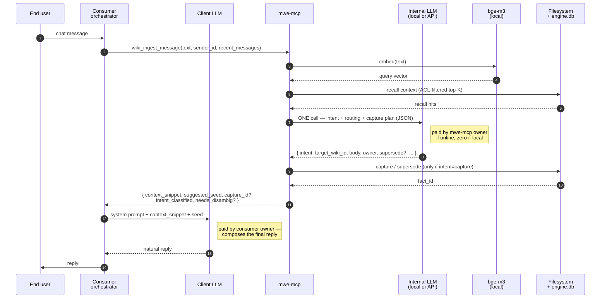
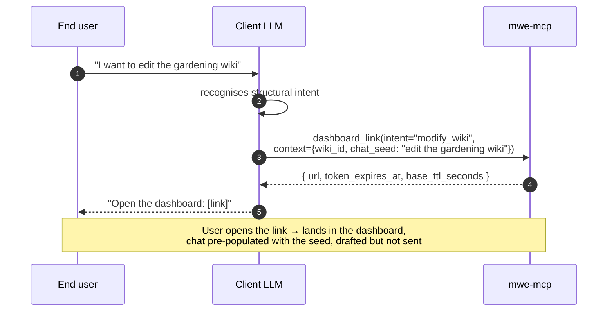

# Runtime topology & cost model

This is the **dynamic** view of mwe-mcp: who the actors are at runtime,
where the model calls happen, which calls cost money, and which never
do. The static view (crates, modules, storage layout) lives in
[overview.md](overview.md); this page is about *what moves and what it
costs while the system is running*.

The single most important thing to internalise: **there are two LLMs in
the picture and they are billed to two different parties.** Most of the
design decisions on this page fall out of keeping those two bills
separate and keeping mwe-mcp's own bill close to zero.

---

## 1. The four actors

A request that ends up in a memory wiki passes through four distinct
runtime actors. Only the third one (mwe-mcp) ever runs *mwe-mcp's* LLM
or embeddings.

```mermaid
flowchart TB
    User["1 — End user<br/>(Telegram, voice, browser, Slack, VSCode...)"]

    subgraph Consumer["2 — Consumer orchestrator (any product)"]
        ConsumerLLM["CLIENT LLM<br/>(Sonnet / Opus / GPT-4 / Gemini / Llama...)"]
        ConsumerTools["Consumer-side tools<br/>(transport, integrations, product admin)"]
        ConsumerSkills["Client-side skills<br/>(markdown, optional)"]
    end

    subgraph MWE["3 — mwe-mcp server"]
        MWETools["MCP tool surface<br/>(see schemas::all_tools)"]
        MWELLM["INTERNAL LLM<br/>(configurable: local Ollama / API)"]
        Embed["Embeddings — bge-m3<br/>(local, always)"]
        Cron["REM cron<br/>(nightly reorganisation)"]
    end

    subgraph Storage["4 — Storage"]
        FS["Filesystem wikis/<br/>(markdown SSOT)"]
        DB["engine.db<br/>(fact_index, events, audit, archive)"]
    end

    User <--> Consumer
    Consumer <-->|MCP over HTTP| MWE
    MWE <--> Storage
    ConsumerLLM -.bill to consumer owner.-> ExtA[("External LLM API")]
    MWELLM -.bill to mwe-mcp owner, only if online.-> ExtB[("External LLM API, optional")]
    MWELLM -.local, zero cost.-> Local[("Ollama")]
    Embed -.local, zero cost.-> Local

    style ConsumerLLM fill:#3a2a1f
    style MWELLM fill:#1f3a2a
    style Embed fill:#1f2a3a
```

| # | Actor | Hosts | Runs which model | Notes |
|---|---|---|---|---|
| 1 | **End user** | — | none | Talks over some channel. Does not know mwe-mcp exists. |
| 2 | **Consumer orchestrator** | the **client LLM** + product-specific tools | client LLM (Sonnet/Opus/GPT-4/Gemini/Llama...) | The application server (home assistant, work copilot, Discord bot, VSCode plugin...). Owns the conversation. Talks to mwe-mcp via MCP over HTTP. |
| 3 | **mwe-mcp server** | the **internal LLM** + embeddings + REM cron | internal LLM (local or API) + `bge-m3` embeddings | Exposes the MCP tool surface, runs local embeddings on every per-turn call, runs the nightly REM cycle. The internal LLM is chosen and paid for **separately** from the client LLM. |
| 4 | **Storage** | filesystem SSOT + `engine.db` | none | `wikis/<wiki_id>/` markdown is the source of truth; `engine.db` holds `fact_index`, events, audit, archive. |

The transport is **HTTP only** — the consumer connects to the MCP
server over HTTP (`127.0.0.1` for a same-host install, a tunnel when
remote). See [protocol/mcp-tools.md](../protocol/mcp-tools.md) for the
exposed tool surface and wire details.

> **Self-hosted vs. multi-tenant.** In a private self-hosted setup,
> actor 2 and actor 3 have the *same* owner, so "two bills" collapse to
> one account. In a multi-tenant setup they diverge: one provider hosts
> mwe-mcp (actor 3), each team brings its own client LLM (actor 2). The
> code makes no assumption either way — the separation is structural, not
> a deployment flag.

---

## 2. Two LLMs, two separate bills

The **client LLM** (actor 2) and the **internal LLM** (actor 3) are
different models, behind different adapters, paid by different parties.

- The **client LLM** is whatever the consumer's product is built on. It
  writes the final reply the user reads. mwe-mcp never invokes it and
  never sees its key.
- The **internal LLM** is configured in `mwe-mcp.config.yaml`, pinned
  per-function (see [§6](#6-where-the-internal-llm-actually-runs)).
  Its adapter is the `LlmBackend` trait in `crates/mwe-core/src/llm.rs`;
  the shipped backends are `OllamaBackend` (local, zero cost),
  `AnthropicBackend`, and `GeminiBackend` (online, metered). A request
  is uniform across backends — swapping providers is a config edit, not
  a code change.

### The fundamental asymmetry

> **The consumer pays the conversation volume. mwe-mcp pays only the
> floor.**

Every conversational turn runs the client LLM at least once (to compose
the reply) — that is the dominant, pay-per-token cost, and it scales
linearly with how much the user talks. mwe-mcp's own spend is a *floor*:
the nightly REM cycle plus the per-turn internal-LLM call inside
`wiki_ingest_message`. If the internal LLM is local, that floor is
literally zero dollars (only electricity and VRAM). If it is an API, it
is one to two orders of magnitude below the consumer's bill.

### The embedding-is-always-local rule

Embeddings (`bge-m3` by default, via the `Embedder` trait in
`crates/mwe-core/src/embedder.rs`) run **locally, always**. There is no
"embed via API" path wired for the hot recall/capture loop. Cost is
zero dollars; the requirement is the VRAM/RAM to keep the model hot
(roughly a few GB). Every recall, every dedup at capture time, every
search query is therefore zero-dollar — see the matrix below.

---

## 3. Who pays for what

This is the cost-attribution matrix: for each runtime function, who
triggers it, which LLM (if any) runs, and who pays.

| Function | Triggered by | Model that runs | Who pays | Cost |
|---|---|---|---|---|
| **Reply to the user (the turn)** | consumer's client LLM | client LLM | consumer owner | Dominant. Pay-per-token, scales with conversation volume. |
| **Consumer-side intent triage** *(optional)* | consumer orchestrator | the consumer's own model | consumer owner (hardware) | Zero $, energy only. Distinct from mwe-mcp's `ingest`. |
| **`wiki_search` / `recall_core_global` / internal recall** | consumer agent (or `wiki_ingest_message` internally) | **embeddings only** | mwe-mcp owner (hardware) | **Zero $.** Embed query + cosine scan + ACL filter. No LLM. |
| **Capture / dedup (`wiki_capture`, internal)** | the `ingest` LLM, dashboard, or REM | **embeddings only** | mwe-mcp owner (hardware) | **Zero $.** Embed body + deterministic jaccard 6-gram dedup + index insert. No LLM. |
| **Ingest inside `wiki_ingest_message`** *(default conversational turn)* | mwe-mcp | internal LLM (`ingest` function) | mwe-mcp owner (local or API) | Zero if local; a fraction of a cent per call on a small API model. One LLM call per turn. |
| **Hub Writer (`index.md` regeneration)** | mwe-mcp (nightly REM sub-job) | internal LLM (`hub_writer`) | mwe-mcp owner | Zero if local — short summaries, a 7-9B is plenty. Runs only inside the nightly cycle, capped by `RemPolicy::hub_writer_cap` (default 10 wikis/night). |
| **REM promotions (paragraph → file → wiki)** | mwe-mcp (nightly cron) | internal LLM (`rem_promotions`, **strong**) | mwe-mcp owner | The quality-critical spend. Local strong model → zero $; online (Sonnet/Opus) → cents per promotion. A cheap deterministic pre-filter (the `auto_promote_min_page_facts` page-mass floor) selects pages **before** the strong model runs, and the sub-job is hard-capped at `RemPolicy::auto_promote_cap` (default 5/night). |
| **REM semantic dedup confirmation** | mwe-mcp (nightly cron) | internal LLM (`rem_dedup_semantic`, **small**) | mwe-mcp owner | Zero if local; ~a tenth of a cent online. |
| **Smart-wiki authoritative write** | smart consumer via `wiki_admin_push` | **the consumer's** LLM (for the markdown) | consumer owner | **Zero $ on mwe-mcp side** — pure I/O + indexing. The markdown is a side effect of the consumer's normal generation. Resolves the "double bill" for smart consumers (see [§7](#7-the-smart-consumer-path--no-internal-llm)). |
| **Smart-wiki notify (`wiki_admin_notify`)** | any consumer | none | mwe-mcp owner (hardware) | Zero $. A pure append to `_briefing.md`. |
| **Consumer-specific tools** | consumer | none (mwe-mcp's view) | consumer owner | Out of mwe-mcp scope. |
| **Client-side skills** | developer via their client | the client's LLM | developer | Their personal quota. mwe-mcp does not host skills. |

Read the matrix top-to-bottom and a pattern emerges: **everything in
the per-turn hot path that mwe-mcp owns is either embedding-only
(zero-dollar) or a single small internal-LLM call.** The expensive,
quality-critical work (REM promotions) is batched into the nightly
cycle where latency does not matter and a strong model can be afforded
selectively.

---

## 4. The hot-path-is-LLM-free invariant

> **The per-turn atomic operations are deterministic I/O plus local
> embeddings. mwe-mcp's *internal* LLM runs in exactly two places: once
> per turn inside `wiki_ingest_message`, and in the nightly REM cycle.**

Concretely, verified against the code:

- **Recall** (`recall::wiki_search` / `wiki_recall` /
  `wiki_facts_for` in `crates/mwe-core/src/recall.rs`): embed the query
  with `bge-m3`, brute-force cosine against the candidate set, drop rows
  the sender cannot read (`acl::can_read`), bump recall counters. No LLM
  touches this path. The MCP `wiki_search` handler
  (`crates/mwe-mcp-server/src/mcp/tools.rs::call_wiki_search`) is a thin
  wrapper over `recall::wiki_search` — embeddings in, ranked hits out.
- **Capture / supersede / forget / link**
  (`crates/mwe-core/src/capture.rs`): embed the body, run the
  **deterministic** jaccard 6-gram dedup (`recall::jaccard_sets`),
  render the `{{owner=… allow=… sender=… f=…}}…{{/}}` marker, append to
  the page with an `atomic_write`, insert the `fact_index` row. The only
  model call is the local embedding. The jaccard threshold (default
  `0.85`, `recall::DEFAULT_DEDUP_THRESHOLD`) is a pure string-similarity
  test — no semantic model in the loop.

The *only* internal-LLM round-trips on a live request are:

1. **`wiki_ingest_message`** — exactly one `LlmBackend::complete` call
   per turn (see [§5](#5-the-default-conversational-flow)).
2. **The nightly REM cycle** — batched, offline, no user waiting (see
   [§8](#8-the-nightly-rem-cycle)).

This is what keeps p99 latency bounded and the bill predictable: the
deterministic floor never surprises you, and the one variable cost per
turn is a single small-model call you can move to local hardware.

---

## 5. The default conversational flow

`wiki_ingest_message` is the single entry point a consumer agent calls
every turn. The consumer hands over the **raw** user message; mwe-mcp's
internal LLM does *all* the routing — intent classification, scope
selection, capture/supersede/skip — and hands back only what the agent
needs to phrase a reply. The agent never sees structure or paths.

### Sequence, mapped to the code

The orchestrator is `ingest::wiki_ingest_message` in
`crates/mwe-core/src/ingest.rs`. Per call:

1. **Recall** (`recall::wiki_recall`) — embed + cosine + ACL, top-K
   context. A transient recall failure degrades silently to an empty
   hit list rather than killing the turn.
2. **Enumerate writable wikis** (`WikiTree::walk`) — a bounded, compact
   list shown to the router. Wikis whose `_meta.md` carries `smart:
   true` are **filtered out** here: smart wikis are written only by the user's
   smart consumer via `wiki_admin_*`, never routed through ingest.
3. **One internal-LLM call** (`LlmBackend::complete`, temperature `0.1`;
   the token cap lives with the function spec in
   [`llm-functions.md`](../design-notes/llm-functions.md)) producing a
   single strict JSON object that encodes
   *both* the intent classification and the operational plan (target
   wiki, body, owner, `fact_type`, topics, supersede target, disambig
   need). Calling the model **once** — rather than intent → routing →
   seed as three round-trips — is what keeps latency inside the
   conversational budget and the cost predictable.
4. **Route by intent** (`capture` / `recall` / `structural` / `skip`):
   on `capture`, the validated plan goes to `capture::wiki_capture`
   (or `wiki_supersede` when the model named a row to retire);
   `recall`/`skip`/`structural` perform no write.
5. **Assemble** the `IngestResponse`.

Untrusted model output is normalised in code before it can do harm: a
hallucinated `target_wiki_id` that is not in the enumerated window, a
`supersede_target` that was not in this turn's recall, or an unsafe page
path are all caught and **demoted to a `skip`** with a canned seed and a
`warn` log — the consumer never sees a 500 for what is really a model
mistake. Genuine infrastructure failures (DB, embedder, filesystem)
still propagate.

### What `wiki_ingest_message` returns

- `context_snippet` — recall context, pre-formatted for the agent's
  system prompt.
- `suggested_seed` — a natural-language draft reply the agent can
  refine (or replace).
- `capture_id` — audit-only `fact_id` of a newly captured row. **The
  agent must not cross-link to it in chat.**
- `needs_disambig` + `disambig_candidates` — set when the message was
  ambiguous and the agent should ask the user to choose.
- `intent_classified` — the intent string, for logging/debug.
- `took_ms` — wall-clock duration of the orchestrator.

### What it NEVER returns

The response carries **no filesystem paths**, no internal wiki structure
(parents, children, slugs), and no metadata beyond what the turn needs.
The consumer agent is kept structurally blind: it phrases replies, it
does not navigate a tree. Paths like `wikis/zoe/giardinaggio/` stay
inside mwe-mcp. This is enforced by the shape of `IngestResponse`
itself — the fields above are all there is.

### Latency envelope

A turn adds roughly **~500 ms to ~2 s** over a path with no memory call,
dominated by the single internal-LLM round-trip. With a local Ollama
workhorse (7-9B) the cost is generation time on local hardware; with a
small API model latency is similar but billed. Embedding and the
deterministic dedup contribute single-digit milliseconds at the target
workdir size.

---

## 6. Where the internal LLM actually runs

The internal LLM is not one model — it is a set of **named functions**,
each pinned independently in `mwe-mcp.config.yaml` to a backend +
model. They differ in quality requirement, latency tolerance, and
frequency, so they are tuned separately:

| Function | Fires when | Quality needed |
|---|---|---|
| `ingest` | per conversational turn (`wiki_ingest_message`) + the dashboard chat | low-medium |
| `hub_writer` | nightly REM sub-job (regenerates `index.md` hubs), capped per night | low-medium |
| `rem_promotions` | nightly cron, capped per night | **high** |
| `rem_dedup_semantic` | nightly cron, after jaccard pre-filter | low |
| `cronista` | the narrative prose compiler, once per dirty standard-wiki leaf | **high** (strong) |

Plus **embeddings** (`bge-m3`), which always run and are always local.

The `cronista` slot is the **narrative prose-compiler slot**: the
`LlmFunction::Cronista` variant backs Il Cronista in
`crate::compiler::compile_leaf_page`, which rewrites each dirty standard-wiki
leaf from its own facts into cohesive prose. It wants a **strong** model
(faithful fact→prose without invention or leak) and the dashboard admin
UI surfaces it like the other slots.

The shipped `LlmBackend` implementations (`crates/mwe-core/src/llm.rs`)
are `OllamaBackend`, `AnthropicBackend`, and `GeminiBackend`. The
operator picks a profile at setup — *all-local* (zero API cost),
*hybrid* (local for the high-volume `ingest`/`hub_writer`, an API model
for the quality-critical REM), or *all-API*. Because the trait
contract is uniform, the profile is a config choice with no code impact.

> Do not pin specific model names as load-bearing facts here — the
> concrete picks live in the operator's `mwe-mcp.config.yaml` and the
> profile presets. What is invariant is the *function set* and the
> *quality tier* each function needs.

---

## 7. The smart consumer path — no internal LLM

A **smart consumer** (a coding agent like Claude Code, `consumer_class
= smart`) manages its own **smart wikis** without ever touching
mwe-mcp's internal LLM. It generates structured markdown with its **own**
LLM budget — capability it already has to answer the user — and ships
it through the admin tools (`wiki_admin_push` /
`wiki_admin_pull` / `wiki_admin_notify` / `wiki_admin_lease_acquire` /
`wiki_admin_lease_release`).

The "double bill" that would hit a smart consumer if it routed every
capture through `wiki_ingest_message` (paying *both* its own LLM *and*
mwe-mcp's `ingest` LLM) is resolved by construction: for smart
wikis, mwe-mcp does only the I/O and indexing — zero-dollar — and the
markdown comes from the consumer's already-paid generation. This is why
ingest deliberately filters smart wikis out of its routable
set (see [§5](#5-the-default-conversational-flow) step 2): they are not
its to write.

For the full smart-consumer flow (bootstrap, scenarios, smart-wiki
lifecycle) see
[design-notes/smart-wikis.md](../design-notes/smart-wikis.md).

---

## 8. The nightly REM cycle

REM (the nightly self-reorganisation, named after the legacy MWE
plugin) runs with no user connected. It is the second — and only other —
place the internal LLM runs, and it is where mwe-mcp's quality-critical
spend lives. The cycle is a sequence of sub-jobs wired in
`rem::run_cycle` (`crates/mwe-core/src/rem.rs`):

- **Auto-apply / auto-finalize sweeps** — advance proposals whose
  confirmation deadline elapsed. No LLM (one sweep may invoke a small
  model for an apply step).
- **Revisor (semantic dedup)** — jaccard pre-filter (deterministic),
  then a **small** model confirms the merge. This is `rem_dedup_semantic`.
- **Auto-promote** — paragraph → file → wiki promotions, the
  quality-critical job, on the **strong** `rem_promotions` model. A
  deterministic pre-filter (the `auto_promote_min_page_facts`
  page-mass floor) selects pages **before** the strong
  model is asked anything — that cheap gate is what keeps the
  strong-model spend bounded. The sub-job is hard-capped at
  `RemPolicy::auto_promote_cap` (default 5/night).
- **Archive detector** — propose archival of cold regions. No LLM.
- **Briefing dispatcher + backlink reciprocity** — emit `_briefing.md`
  notes for the smart consumer's smart wikis. No LLM (deterministic
  detection).
- **Lease expirer** — release stale admin leases. No LLM.
- **Briefing processor (non-smart)** — drain `wiki_briefing_items`
  for non-smart wikis, applying each comment-style item as a fact
  correction. No LLM (deterministic apply).
- **Hub Writer** — regenerate `index.md` summaries on the `hub_writer`
  model. Runs last (so it sees a stable post-archive snapshot) and only
  here — `run_hub_writer` has no call site outside `run_cycle`; bounded
  by `RemPolicy::hub_writer_cap` (default 10 wikis/night).

Two structural facts about the cycle, both verified in `run_cycle`:

1. A **smart-wiki index** (`wiki_id → smart: bool`) is built once per
   cycle by walking each wiki's `_meta.md`. The write-side sub-jobs **skip**
   smart wikis (those are the smart consumer's to write); the
   briefing/backlink sub-jobs **target** them. One shared map means no
   two sub-jobs disagree on whether a wiki is smart.
2. The cost-heavy work is **batched and offline** — no user is waiting,
   so a strong (and possibly metered) model can be afforded for
   `rem_promotions` while everything else stays on cheap local models.

Results land in `engine.db` events (and `_briefing.md` for smart wikis);
the consumer drains them at its own cadence via `events_poll`. mwe-mcp
routes nothing — it emits and the consumer decides what to do.

---

## 9. Structural intent → dashboard, via `dashboard_link`

Conversational turns go through `wiki_ingest_message`. **Structural**
intent — "modify my gardening wiki", "create a type for recipes",
"change the scope of the work wiki" — does not. Either the agent
recognises the pattern directly, or `wiki_ingest_message` returns
`intent_classified = "structural"` with a seed nudging the agent toward
`dashboard_link`. Structural edits need the full context of the
dashboard, not a chat-level affordance.

`dashboard_link` (`call_dashboard_link` in
`crates/mwe-mcp-server/src/mcp/tools.rs`) mints a short-lived dashboard
session token and returns a URL. Two mechanics matter:

- **Sliding TTL.** The session is minted with a **10-minute** base TTL
  (`DASHBOARD_LINK_TTL`), and the dashboard cookie middleware refreshes
  it on every interaction. A user working in the dashboard for hours is
  never logged out; one who closes it and comes back after the window
  must get a fresh link. The response surfaces both `token_expires_at`
  (the initial stamp) and `base_ttl_seconds` so the caller's mental
  model matches what the cookie will do.
- **`chat_seed` pre-population.** If the user already typed the details
  in the conversational agent, the agent passes them in
  `context.chat_seed`; `dashboard_link` URL-encodes them into a
  `&chat_seed=…` query parameter so the dashboard's chat opens with that
  text drafted (not sent). The user hits enter or edits first.

Some intents (`settings`, `audit`, `costs`) are admin-only and rejected
for a non-admin token.

---

## 10. Invariant: atomic `_internal.*` tools are not on the MCP surface

The atomic operations — `wiki_capture`, `wiki_supersede`,
`wiki_navigate`, `wiki_recall`, `wiki_link`, `wiki_forget`,
`users_resolve`, and the rest — are **not exposed over MCP**. They are
internal `mwe-core` library functions, composed only by:

- the **`ingest` LLM** inside `wiki_ingest_message` (it composes the
  deterministic `recall → route → capture/supersede` sequence),
- the **dashboard chat** (when the operator issues natural commands), and
- the **nightly REM** cycle.

You can confirm what *is* exposed by reading the registration list
`schemas::all_tools()` in
`crates/mwe-mcp-server/src/mcp/schemas.rs` — none of the atomic
`_internal.*` names appear there. The surfaced tools are the
conversational entry point (`wiki_ingest_message`), the structural
redirect (`dashboard_link`), read/search/audit tools, the event and
proposal flows, the smart-consumer admin family (the five
`wiki_admin_*` tools — `push` / `pull` / `notify` / `lease_acquire` /
`lease_release`), and setup/discovery tools. The registration list is
the source of truth for the exact set; the names above just sketch the
shape.

The invariant in one line:

> **A consumer's client agent never calls an atomic tool — not even
> under a different name. Per turn → `wiki_ingest_message`. For
> structural intent → `dashboard_link`. The internal LLM decides the
> atomic sequence; the agent receives only `context_snippet` +
> `suggested_seed` (+ optional `intent_classified` / disambig).**

A developer embedding `mwe-core` as a library can call the atomic
functions directly (migration scripts, tests, batch admin tooling) —
but that bypasses MCP entirely and is not a path any consumer agent
takes.

---

## 10. The trust boundary is the host, not the protocol

Per-reader redaction is enforced **at the MCP render**: `can_read` +
`render_for_sender` project every response for the calling identity. The
prose on disk, however, is cleartext — the bare `{{f=…}}` markers carry
only keys, and nothing in the filesystem hides a region from a local
reader. A consumer agent running **on the same host as the workdir, with
shell or file tools** (most agent frameworks ship them) can therefore
read the raw memory-wiki tree and bypass the governance entirely —
observed live on the first hermes deployment: the agent `grep`-ed the
workdir, read other users' pages directly, and noted the path in its
local memory for future use.

Whether this exposure is a *real* ACL bypass or a benign one depends on
the **principal model** of the box: the leak only matters when the
machine holds fragments owned by someone who *also* has OS-level access.
On a single-principal box (the agent serves one human and runs as them)
reading the raw tree only re-exposes data that principal already owns —
near-zero marginal risk. On a multi-user box — a shared family wiki, or a
consumer serving several humans where one of them has shell access —
user A's shell reads user B's restricted fragments straight off disk.
The rule that falls out: **never co-locate the workdir on a machine where
a principal whose data the ACL governs also has OS-level access.**

Deployment rule, in order of strength:

1. **Separate machines** (the production topology): the consumer reaches
   the server only over HTTP — the boundary holds by construction. Note
   that **stdio transport is inherently same-host, same-principal** (the
   consumer spawns the server as a subprocess), so it cannot provide this
   separation; only remote HTTP can.
2. **Same machine, separate OS users**: the gateway/agent process runs as
   a user with no access to the workdir, owned by the mwe-mcp user and
   `chmod 700` (the directory's execute bit is the master gate — without
   it no other user can traverse in, whatever the inner file modes). Use
   `750` only when the consumer is deliberately placed in the workdir's
   owning group and you want it group-readable; otherwise `700` is the
   safe default.
3. **Same user** (dev/test only): if the host framework supports
   per-channel toolset restriction (e.g. hermes `platform_toolsets`),
   drop the shell/file toolsets from end-user channels — and treat it as
   a mitigation, not a boundary: it is enforcement inside the same
   process.

The server makes this non-skippable-by-distraction rather than silently
insecure, at two strengths (`core::workdir_security`):

- **Advisory perms audit.** `mwe-mcp serve` audits the workdir at boot and
  **warns** for every path reachable by group or world, and `mwe-mcp
  doctor` prints the same report with a `chmod` remediation. This catches
  *other* users; it is advisory and the server still starts.
- **Dedicated-user gate (the same-user case 0700 cannot fix).** `serve`
  **refuses to boot** when it runs as **root** or as a **login-capable
  account** (a real login shell — read from `/proc/self/status` +
  `/etc/passwd`, no FFI). The rationale is that 0700 owned by a login
  user does nothing against that *same* user: a co-located agent running
  as the same login account reads the cleartext bytes regardless — only a
  dedicated service account (a `nologin` system user no interactive
  principal shares) closes it. **On an interactive terminal** `serve`
  doesn't merely print the fix — it **offers to provision the service**:
  on confirmation it creates the `mwe-mcp` account, installs the binary at
  `/usr/local/bin/mwe-mcp`, relocates (preserving data) or creates the
  workdir at `/home/mwe-mcp/workdir` owned `0700`, installs the
  `mwe-mcp.service` unit (`User=mwe-mcp`, `Restart=on-failure`, boot-
  enabled — the same unit the tray controls), and `enable --now`s it; the
  foreground command then hands the port to the service and exits. Each
  privileged step is shown and runs under `sudo`; declining (or a
  non-interactive host — systemd, CI, container, piped) falls back to the
  printed `useradd`/`install`/`chown`/`chmod` steps. The explicit
  **`--bypassdedicateduser`** opt-out starts anyway (with a loud warning)
  for hosts where a dedicated user is impossible — containers, some
  managed/remote servers, or a **box dedicated to mwe-mcp** where no
  consumer shares the machine and there is nothing to wall off (the
  recommended remote topology, option 1). On an interactive bypass run
  under a login account, `serve` likewise **offers a restart-on-boot
  service** — the same `mwe-mcp.service`, but `User=<login user>` with the
  bypass baked into `ExecStart` and no workdir relocation. Both units pin
  `XDG_CACHE_HOME` inside the workdir so the bge-m3 weights download
  succeeds under `ProtectSystem=strict`. macOS/Windows forms are tracked in
  [roadmap group 14](../roadmap.md).
- **Optional desktop tray.** Where a desktop session exists, `mwe-mcp-tray` — a
  **separate** Linux/KDE binary (its own crate; `ksni` / `StatusNotifierItem`,
  no GTK/OpenSSL) — surfaces a status icon (coloured running / grey stopped,
  polled) and a menu (open dashboard / logs, Start / Restart / Stop). It drives
  `mwe-mcp.service` via `systemctl` through a polkit rule (`49-mwe-mcp.rules`, no
  password prompt), and is absent on a headless host (registration fails fast
  with no D-Bus session). Cross-platform tray forms are tracked in
  [roadmap group 14](../roadmap.md).

The check reads POSIX mode bits; encryption-at-rest is *not* a
substitute, because a co-located same-uid process can reach the key. Note
the DB-authoritative move did not close this: it concentrated the ACL
into `engine.db`, itself a plain SQLite file on disk.

---

## Related pages

- [overview.md](overview.md) — the static crate/module/storage view.
- [protocol/mcp-tools.md](../protocol/mcp-tools.md) — the exposed MCP
  tool surface.
- [design-notes/ingest-pipeline.md](../design-notes/ingest-pipeline.md)
  — `wiki_ingest_message` in depth.
- [design-notes/recall-pipeline.md](../design-notes/recall-pipeline.md)
  and
  [design-notes/capture-and-dedup.md](../design-notes/capture-and-dedup.md)
  — the LLM-free hot path.
- [design-notes/rem-cycle.md](../design-notes/rem-cycle.md) — the
  nightly REM cycle in depth.
- [design-notes/admin-llm-config.md](../design-notes/admin-llm-config.md)
  — how the internal LLM functions are configured.
- [design-notes/smart-wikis.md](../design-notes/smart-wikis.md)
  — the smart-consumer / `wiki_admin_*` path.
